# Python Fundamentals: Complete Revision Guide

## Table of Contents

1. [Python Syntax and Execution Model](#python-syntax-and-execution-model)
2. Data Types and Variables
3. Control Flow (if, loops, match)
4. Functions and Functional Concepts
5. Object-Oriented Programming
6. Error and Exception Handling
7. Modules, Packages, and Virtual Environments
8. Standard Library Essentials
9. Memory Management and References
10. Iterators, Generators, and Decorators
11. Basic Concurrency (Threading, Multiprocessing, Async)
12. Interview Preparation

---

## Python Syntax and Execution Model

### Overview

Python is an interpreted, dynamically-typed, high-level programming language. Understanding how Python executes code and its syntax rules is fundamental to writing effective Python programs.

### Python Execution Flow

Python code goes through several stages before execution:

1. **Source Code (.py)** → Written by developers
2. **Bytecode (.pyc)** → Compiled by Python interpreter
3. **Python Virtual Machine (PVM)** → Executes bytecode

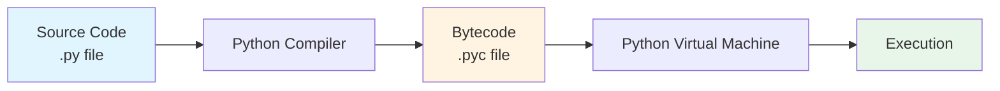

### Key Execution Concepts

#### 1. Interpretation vs Compilation

Python is **interpreted**, but it's not purely interpreted. The source code is first compiled to bytecode, which is then interpreted by the PVM.

```python
# When you run this file, Python:
# 1. Compiles it to bytecode
# 2. Stores bytecode in __pycache__ (for imports)
# 3. Executes bytecode in PVM

def greet(name):
    return f"Hello, {name}!"

print(greet("Python"))
```

#### 2. The Python Execution Model

```python
# Python executes code top-to-bottom, line-by-line
print("First")   # Executes first
x = 10          # Then this
print("Second")  # Then this

# Function definitions are executed (registered), but body runs only when called
def calculate():  # This line executes (function object created)
    return 5 + 5  # This line does NOT execute until function is called

result = calculate()  # NOW the function body executes
```

#### 3. The Global Interpreter Lock (GIL)

Python has a GIL that allows only one thread to execute Python bytecode at a time, even on multi-core systems.

```python
import threading

# Due to GIL, these threads won't run truly in parallel for CPU-bound tasks
def cpu_intensive_task():
    total = sum(i * i for i in range(10_000_000))
    return total

# Two threads, but only one executes Python bytecode at a time
t1 = threading.Thread(target=cpu_intensive_task)
t2 = threading.Thread(target=cpu_intensive_task)
```

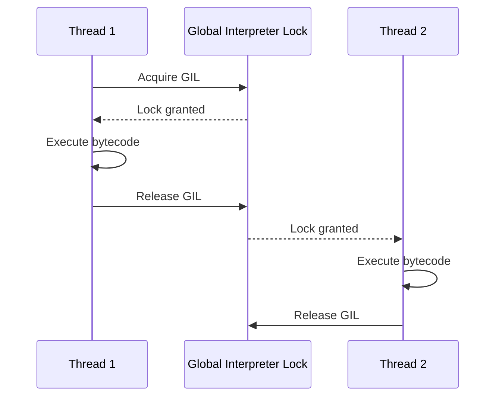

### Python Syntax Fundamentals

#### 1. Indentation is Semantic

Python uses indentation to define code blocks (not braces like C/Java).

```python
# Correct
if True:
    print("Indented")
    print("Part of if block")

# SyntaxError: inconsistent indentation
if True:
    print("4 spaces")
      print("6 spaces - ERROR!")

# Best practice: Use 4 spaces (PEP 8 standard)
def function():
    if condition:
        for item in items:
            print(item)  # Consistent 4-space indentation
```

#### 2. Dynamic Typing

Variables don't have fixed types; the type is determined at runtime.

```python
# Same variable can hold different types
x = 10           # x is int
x = "Hello"      # Now x is str
x = [1, 2, 3]   # Now x is list

# Type checking happens at runtime
def add(a, b):
    return a + b

add(5, 3)        # Works: 8
add("Hi", "!")   # Works: "Hi!"
add(5, "Hi")     # TypeError at runtime
```

#### 3. Everything is an Object

In Python, everything (including functions, classes, modules) is an object.

```python
# Numbers are objects
x = 42
print(type(x))  # <class 'int'>
print(x.__class__)  # <class 'int'>

# Functions are objects
def greet():
    return "Hello"

print(type(greet))  # <class 'function'>
another_name = greet  # Assign function to another variable
print(another_name())  # "Hello"

# Classes are objects
class MyClass:
    pass

print(type(MyClass))  # <class 'type'>
```

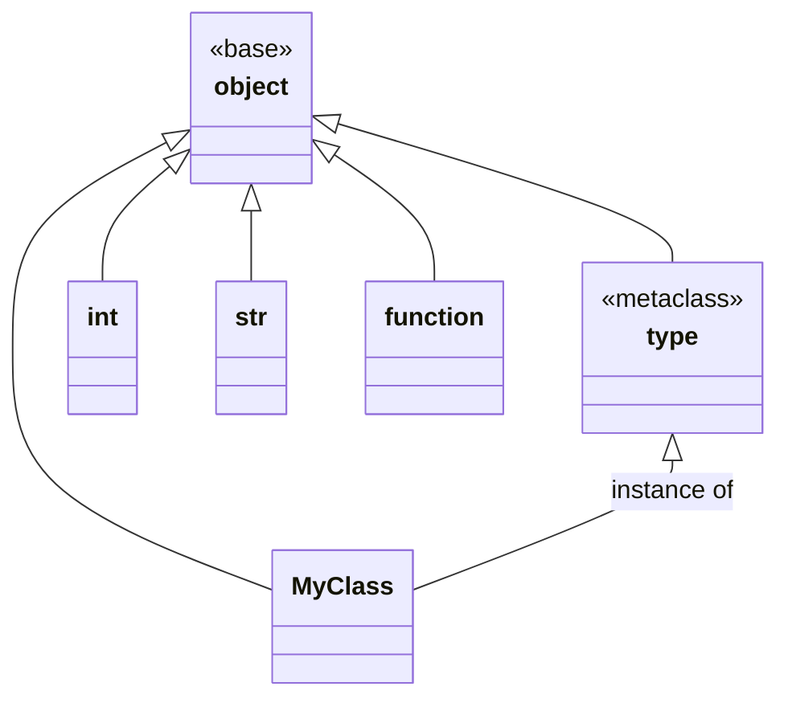

#### 4. Name Binding and Scopes

Python uses name binding rather than traditional variable assignment.

```python
# Name binding
x = 10  # Name 'x' is bound to object 10

# Multiple names can bind to same object
y = x   # 'y' is bound to same object as 'x'

# Rebinding
x = 20  # 'x' now bound to different object (y still points to 10)

print(x)  # 20
print(y)  # 10
```

**LEGB Rule** - Python searches for names in this order:

- **L**ocal: Inside current function
- **E**nclosing: In any enclosing functions
- **G**lobal: Module level
- **B**uilt-in: Python built-ins

```python
x = "global"  # Global scope

def outer():
    x = "enclosing"  # Enclosing scope

    def inner():
        x = "local"  # Local scope
        print(x)  # Prints "local"

    inner()
    print(x)  # Prints "enclosing"

outer()
print(x)  # Prints "global"

# Built-in scope
print(len([1, 2, 3]))  # 'len' from built-in scope
```

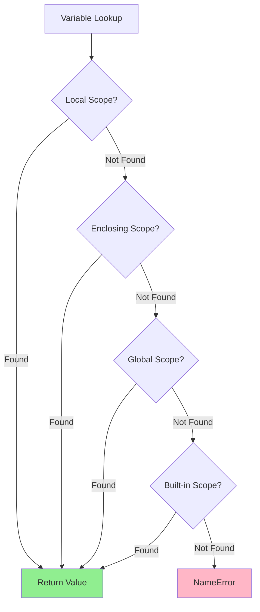

#### 5. Interactive Mode vs Script Mode

```python
# Interactive mode (REPL)
# Every expression's value is automatically printed
>>> 5 + 5
10
>>> "hello"
'hello'

# Script mode (.py file)
# Expressions are evaluated but not automatically printed
5 + 5        # Result is calculated but not displayed
"hello"      # String is created but not displayed
print(5 + 5) # Explicitly print: 10
```

#### 6. Statements vs Expressions

- **Expression**: Evaluates to a value
- **Statement**: Performs an action

```python
# Expressions (return values)
5 + 3                    # Expression: evaluates to 8
"hello".upper()          # Expression: evaluates to "HELLO"
x if x > 0 else 0       # Conditional expression

# Statements (perform actions)
x = 10                   # Assignment statement
if x > 5:               # If statement
    print(x)            # Print statement
for i in range(5):      # For statement
    pass

# Some can be both
y = (x := 10)           # Assignment expression (walrus operator, Python 3.8+)
```

### Special Syntax Features

#### 1. Multiple Assignment

```python
# Tuple unpacking
x, y, z = 1, 2, 3

# Swap variables
a, b = b, a

# Extended unpacking (Python 3+)
first, *middle, last = [1, 2, 3, 4, 5]
# first = 1, middle = [2, 3, 4], last = 5
```

#### 2. Line Continuation

```python
# Implicit continuation (inside brackets)
result = (1 + 2 + 3 +
          4 + 5 + 6)

# Explicit continuation (backslash)
total = 1 + 2 + 3 + \
        4 + 5 + 6

# Better: Use implicit (PEP 8 preferred)
data = {
    'name': 'John',
    'age': 30,
    'city': 'NYC'
}
```

#### 3. Comments and Docstrings

```python
# Single-line comment

"""
Multi-line comment
(technically a string literal that's not assigned)
"""

def function(param):
    """
    Docstring: Describes function purpose, parameters, and return value.
    This is accessed via function.__doc__

    Args:
        param: Description of parameter

    Returns:
        Description of return value
    """
    return param * 2

# Accessing docstring
print(function.__doc__)
```

### Practical Example: Understanding Execution

```python
# This demonstrates Python's execution model

print("1. Module starts loading")

def outer_function():
    """This function is defined but not executed yet"""
    print("3. Outer function executes")

    def inner_function():
        """Nested function - defined when outer_function runs"""
        print("4. Inner function executes")

    inner_function()  # Call inner function

print("2. About to call outer_function")
outer_function()  # Now outer_function executes
print("5. Module finishes")

# Output order:
# 1. Module starts loading
# 2. About to call outer_function
# 3. Outer function executes
# 4. Inner function executes
# 5. Module finishes
```

### Interview Insight: Why This Matters

Understanding Python's execution model helps you:

- Debug subtle timing and scope issues
- Optimize performance (understanding GIL for concurrency)
- Write cleaner, more Pythonic code
- Answer questions about Python's internal workings

Common interview questions from this section:

- "Explain Python's GIL and its implications"
- "What is the difference between compiled and interpreted languages? Where does Python fit?"
- "Explain the LEGB rule with an example"
- "Why does Python use indentation instead of braces?"

---

## Data Types and Variables

### Overview

Python has several built-in data types that form the foundation of every program. Understanding these types, their behaviors, and how Python manages them is crucial for writing efficient code.

### Python's Type System

Python is **dynamically typed** (type checking at runtime) and **strongly typed** (no implicit type coercion in most cases).

```python
# Dynamic typing: type determined at runtime
x = 10        # int
x = "hello"   # now str - no error

# Strong typing: no automatic conversion
result = "5" + 5  # TypeError: can't concatenate str and int
result = "5" + str(5)  # "55" - explicit conversion required
```

### Built-in Data Types

Python's built-in types are categorized as:

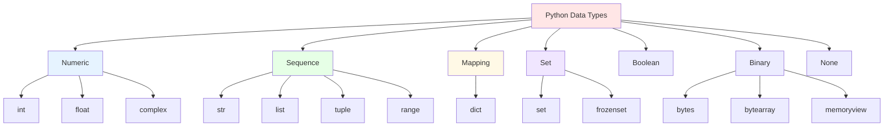

### 1. Numeric Types

#### Integer (int)

Arbitrary precision integers - no overflow!

```python
# Python 3: int has unlimited precision
big_number = 10 ** 100  # 1 followed by 100 zeros - no problem!
print(big_number)

# Different bases
decimal = 42
binary = 0b101010      # Binary (base 2)
octal = 0o52           # Octal (base 8)
hexadecimal = 0x2A     # Hexadecimal (base 16)

print(decimal == binary == octal == hexadecimal)  # True

# Conversions
print(bin(42))   # '0b101010'
print(oct(42))   # '0o52'
print(hex(42))   # '0x2a'

# Integer division vs floor division
print(7 / 2)     # 3.5 (float division)
print(7 // 2)    # 3 (floor division - returns int)
print(-7 // 2)   # -4 (floors toward negative infinity)
```

#### Float (float)

Double-precision floating-point numbers (64-bit).

```python
# Float representation
x = 3.14
y = 2.5e-3  # Scientific notation: 0.0025
z = float('inf')   # Positive infinity
w = float('-inf')  # Negative infinity
nan = float('nan') # Not a Number

# Precision issues (important!)
print(0.1 + 0.2)  # 0.30000000000000004 (not exactly 0.3!)

# Use decimal for precision-critical applications
from decimal import Decimal
a = Decimal('0.1')
b = Decimal('0.2')
print(a + b)  # Decimal('0.3') - exact!

# Checking special values
import math
print(math.isinf(z))    # True
print(math.isnan(nan))  # True

# Float operations
print(5 / 2)      # 2.5
print(5 % 2)      # 1 (modulo)
print(5 ** 2)     # 25 (exponentiation)
print(pow(5, 2))  # 25 (same as **)
```

#### Complex (complex)

Numbers with real and imaginary parts.

```python
# Complex numbers
z1 = 3 + 4j  # or complex(3, 4)
z2 = 2 - 1j

print(z1.real)  # 3.0
print(z1.imag)  # 4.0

# Operations
print(z1 + z2)       # (5+3j)
print(z1 * z2)       # (10+5j)
print(abs(z1))       # 5.0 (magnitude)
print(z1.conjugate()) # (3-4j)
```

### 2. Sequence Types

#### String (str)

Immutable sequences of Unicode characters.

```python
# String creation
s1 = 'single quotes'
s2 = "double quotes"
s3 = '''triple quotes
can span multiple
lines'''
s4 = """also with double"""

# Raw strings (escape sequences ignored)
path = r"C:\new\folder"  # Backslashes are literal

# F-strings (formatted string literals, Python 3.6+)
name = "Alice"
age = 30
message = f"My name is {name} and I'm {age} years old"
print(message)

# Expression in f-strings
print(f"Next year I'll be {age + 1}")
print(f"Uppercase: {name.upper()}")

# String operations
text = "Python Programming"
print(len(text))          # 18
print(text[0])            # 'P' (indexing)
print(text[-1])           # 'g' (negative indexing from end)
print(text[0:6])          # 'Python' (slicing)
print(text[::2])          # 'Pto rgamn' (step slicing)
print(text[::-1])         # 'gnimmargorP nohtyP' (reverse)

# Immutability
# text[0] = 'J'  # TypeError: str object does not support item assignment

# String methods (returns new string)
print("hello".upper())           # 'HELLO'
print("HELLO".lower())           # 'hello'
print("  spaces  ".strip())      # 'spaces'
print("a,b,c".split(","))        # ['a', 'b', 'c']
print(",".join(['a', 'b', 'c'])) # 'a,b,c'
print("hello".replace('l', 'L')) # 'heLLo'
print("hello".startswith('he'))  # True
print("123".isdigit())           # True

# String formatting (multiple ways)
name, age = "Bob", 25
print("Name: %s, Age: %d" % (name, age))  # Old style
print("Name: {}, Age: {}".format(name, age))  # .format()
print(f"Name: {name}, Age: {age}")  # f-string (preferred)
```

#### List (list)

Mutable, ordered sequences - can contain mixed types.

```python
# List creation
empty = []
numbers = [1, 2, 3, 4, 5]
mixed = [1, "hello", 3.14, True, [1, 2]]  # Can mix types

# List operations
print(len(numbers))     # 5
print(numbers[0])       # 1
print(numbers[-1])      # 5
print(numbers[1:4])     # [2, 3, 4]

# Mutability - lists can be modified
numbers[0] = 10
print(numbers)  # [10, 2, 3, 4, 5]

# List methods
numbers.append(6)           # Add to end: [10, 2, 3, 4, 5, 6]
numbers.insert(0, 0)        # Insert at position: [0, 10, 2, 3, 4, 5, 6]
numbers.extend([7, 8])      # Add multiple: [0, 10, 2, 3, 4, 5, 6, 7, 8]
removed = numbers.pop()     # Remove and return last: 8
numbers.remove(10)          # Remove first occurrence of 10
print(numbers.index(5))     # Get index of 5
print(numbers.count(2))     # Count occurrences of 2
numbers.reverse()           # Reverse in place
numbers.sort()              # Sort in place

# List comprehension (powerful!)
squares = [x**2 for x in range(10)]  # [0, 1, 4, 9, 16, 25, 36, 49, 64, 81]
evens = [x for x in range(10) if x % 2 == 0]  # [0, 2, 4, 6, 8]

# Nested list comprehension
matrix = [[i*j for j in range(3)] for i in range(3)]
# [[0, 0, 0], [0, 1, 2], [0, 2, 4]]

# List unpacking
first, *rest, last = [1, 2, 3, 4, 5]
# first=1, rest=[2, 3, 4], last=5
```

#### Tuple (tuple)

Immutable, ordered sequences - often used for heterogeneous data.

```python
# Tuple creation
empty = ()
single = (1,)  # Note the comma! (1) is just 1, not a tuple
coordinates = (10, 20)
mixed = (1, "hello", 3.14)

# Tuple packing and unpacking
point = 10, 20, 30  # Packing (parentheses optional)
x, y, z = point     # Unpacking

# Immutability
# coordinates[0] = 15  # TypeError: tuple object does not support item assignment

# But if tuple contains mutable objects...
t = ([1, 2], [3, 4])
t[0].append(3)  # This works! The list inside is mutable
print(t)  # ([1, 2, 3], [3, 4])

# Tuple methods (only 2!)
numbers = (1, 2, 2, 3, 2)
print(numbers.count(2))  # 3
print(numbers.index(3))  # 3

# Named tuples (from collections)
from collections import namedtuple

Point = namedtuple('Point', ['x', 'y'])
p = Point(10, 20)
print(p.x, p.y)  # 10 20
print(p[0], p[1])  # 10 20 (still works like regular tuple)

# When to use tuple vs list?
# Tuple: Heterogeneous data (like a record), immutable data, dict keys
# List: Homogeneous data (like a collection), data that changes
```

#### Range (range)

Immutable sequence of numbers - memory efficient!

```python
# Range creation
r1 = range(5)        # 0 to 4
r2 = range(1, 10)    # 1 to 9
r3 = range(0, 10, 2) # 0, 2, 4, 6, 8 (step=2)

# Range doesn't store all values - generates them on demand
r = range(1000000)  # Creates instantly, uses minimal memory

# Convert to list to see values
print(list(range(5)))  # [0, 1, 2, 3, 4]

# Common use: for loops
for i in range(5):
    print(i)

# Reverse range
for i in range(10, 0, -1):
    print(i)  # 10, 9, 8, ..., 1
```

### 3. Mapping Type

#### Dictionary (dict)

Mutable, unordered (Python 3.7+ maintains insertion order) key-value pairs.

```python
# Dictionary creation
empty = {}
person = {
    'name': 'Alice',
    'age': 30,
    'city': 'NYC'
}

# Alternative: dict() constructor
person2 = dict(name='Bob', age=25, city='LA')

# Accessing values
print(person['name'])  # 'Alice'
print(person.get('age'))  # 30
print(person.get('country', 'USA'))  # 'USA' (default if key not found)

# Mutability
person['age'] = 31  # Modify
person['country'] = 'USA'  # Add new key-value pair
del person['city']  # Delete key

# Dictionary methods
print(person.keys())    # dict_keys(['name', 'age', 'country'])
print(person.values())  # dict_values(['Alice', 31, 'USA'])
print(person.items())   # dict_items([('name', 'Alice'), ('age', 31), ('country', 'USA')])

# Checking membership
print('name' in person)  # True (checks keys, not values)

# Dictionary comprehension
squares = {x: x**2 for x in range(5)}  # {0: 0, 1: 1, 2: 4, 3: 9, 4: 16}

# Merging dictionaries (Python 3.9+)
dict1 = {'a': 1, 'b': 2}
dict2 = {'c': 3, 'd': 4}
merged = dict1 | dict2  # {'a': 1, 'b': 2, 'c': 3, 'd': 4}

# Update in place
dict1.update(dict2)

# Dictionary unpacking
def greet(name, age):
    print(f"{name} is {age}")

info = {'name': 'Charlie', 'age': 28}
greet(**info)  # Unpacks dict as keyword arguments

# Nested dictionaries
users = {
    'user1': {'name': 'Alice', 'age': 30},
    'user2': {'name': 'Bob', 'age': 25}
}
print(users['user1']['name'])  # 'Alice'

# setdefault and defaultdict
count = {}
for char in "hello":
    count[char] = count.get(char, 0) + 1
# Or use setdefault
count = {}
for char in "hello":
    count.setdefault(char, 0)
    count[char] += 1

# defaultdict (from collections)
from collections import defaultdict
count = defaultdict(int)  # Default value is 0
for char in "hello":
    count[char] += 1  # No need to check if key exists!
```

### 4. Set Types

#### Set (set)

Mutable, unordered collection of unique elements.

```python
# Set creation
empty = set()  # Not {}! That's an empty dict
numbers = {1, 2, 3, 4, 5}
mixed = {1, "hello", 3.14, True}

# Note: True and 1 are considered equal in sets
s = {1, True, 2, False, 0}
print(s)  # {False, 1, 2} (duplicates removed)

# Set operations
numbers.add(6)       # Add element
numbers.remove(1)    # Remove (raises error if not found)
numbers.discard(10)  # Remove (no error if not found)
print(2 in numbers)  # True (membership test - O(1) average!)

# Mathematical set operations
a = {1, 2, 3, 4, 5}
b = {4, 5, 6, 7, 8}

print(a | b)  # Union: {1, 2, 3, 4, 5, 6, 7, 8}
print(a & b)  # Intersection: {4, 5}
print(a - b)  # Difference: {1, 2, 3}
print(a ^ b)  # Symmetric difference: {1, 2, 3, 6, 7, 8}

# Or use methods
print(a.union(b))
print(a.intersection(b))
print(a.difference(b))
print(a.symmetric_difference(b))

# Set comprehension
squares = {x**2 for x in range(10)}

# Remove duplicates from list
numbers = [1, 2, 2, 3, 3, 3, 4]
unique = list(set(numbers))  # [1, 2, 3, 4] (order not preserved)
```

#### Frozenset (frozenset)

Immutable version of set - can be used as dictionary keys.

```python
# Frozenset creation
fs = frozenset([1, 2, 3, 4, 5])

# Immutable - no add, remove, etc.
# fs.add(6)  # AttributeError

# Can be used as dict keys (sets can't)
lookup = {
    frozenset([1, 2]): 'pair one',
    frozenset([3, 4]): 'pair two'
}

# Set operations still work
a = frozenset([1, 2, 3])
b = frozenset([3, 4, 5])
print(a | b)  # frozenset({1, 2, 3, 4, 5})
```

### 5. Boolean Type

```python
# Boolean values
is_valid = True
is_empty = False

# Boolean operations
print(True and False)  # False
print(True or False)   # True
print(not True)        # False

# Truthiness - every object has a boolean value
# Falsy values: False, None, 0, 0.0, '', [], {}, set()
# Everything else is truthy

if []:
    print("Empty list is truthy")  # Won't print
else:
    print("Empty list is falsy")   # Prints

# Comparison operators return booleans
print(5 > 3)   # True
print(5 == 5)  # True
print(5 != 3)  # True

# Chaining comparisons
x = 10
print(0 < x < 20)  # True (equivalent to: 0 < x and x < 20)

# Boolean conversion
print(bool(0))      # False
print(bool(42))     # True
print(bool(""))     # False
print(bool("text")) # True

# Short-circuit evaluation
def expensive():
    print("Called!")
    return True

result = False and expensive()  # expensive() never called!
result = True or expensive()    # expensive() never called!
```

### 6. None Type

```python
# None - Python's null/nil equivalent
x = None

# Only one None object exists
print(x is None)  # True (use 'is', not '==')

# None is falsy
if not None:
    print("None is falsy")  # Prints

# Common use: default parameter
def greet(name=None):
    if name is None:
        name = "Guest"
    print(f"Hello, {name}")

greet()        # "Hello, Guest"
greet("Alice") # "Hello, Alice"

# Functions without explicit return return None
def no_return():
    pass

result = no_return()
print(result)  # None
```

### Type Conversion (Type Casting)

```python
# Explicit conversions
print(int("42"))        # 42
print(int(3.9))         # 3 (truncates, doesn't round)
print(int("1010", 2))   # 10 (binary to int)

print(float("3.14"))    # 3.14
print(float(42))        # 42.0

print(str(42))          # "42"
print(str([1, 2, 3]))   # "[1, 2, 3]"

print(list("hello"))    # ['h', 'e', 'l', 'l', 'o']
print(list((1, 2, 3)))  # [1, 2, 3]

print(tuple([1, 2, 3])) # (1, 2, 3)

print(set([1, 2, 2, 3])) # {1, 2, 3}

# Dict from key-value pairs
print(dict([('a', 1), ('b', 2)]))  # {'a': 1, 'b': 2}

# Error handling
try:
    int("hello")  # ValueError
except ValueError as e:
    print(f"Conversion error: {e}")
```

### Type Checking

```python
# type() - returns the type
x = 42
print(type(x))  # <class 'int'>
print(type(x) == int)  # True

# isinstance() - preferred way to check type
print(isinstance(x, int))  # True
print(isinstance(x, (int, float)))  # True (checks multiple types)

# isinstance respects inheritance
class Animal:
    pass

class Dog(Animal):
    pass

d = Dog()
print(isinstance(d, Dog))     # True
print(isinstance(d, Animal))  # True (Dog inherits from Animal)
print(type(d) == Animal)      # False (type() doesn't respect inheritance)
```

### Memory Efficiency Comparison

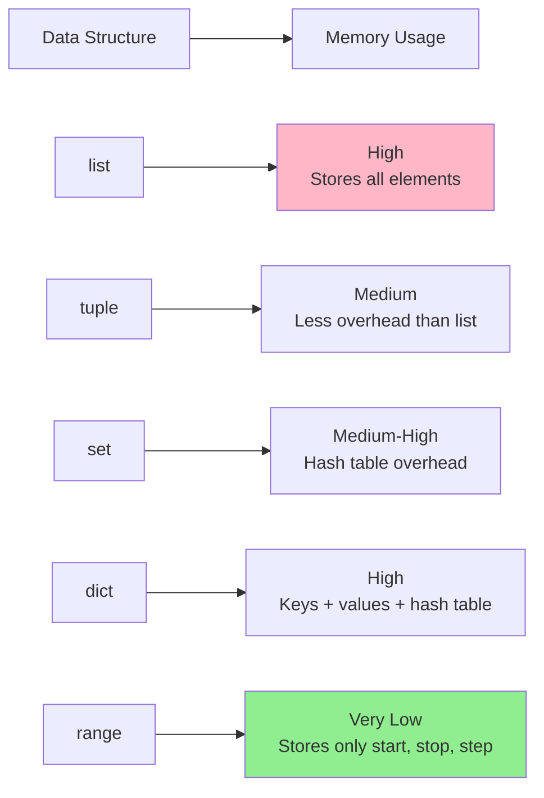

### Practical Example: Data Type Selection

```python
# Problem: Count word frequency in text
text = "apple banana apple cherry banana apple"

# Solution 1: Using dict
word_count = {}
for word in text.split():
    word_count[word] = word_count.get(word, 0) + 1
print(word_count)  # {'apple': 3, 'banana': 2, 'cherry': 1}

# Solution 2: Using defaultdict
from collections import defaultdict
word_count = defaultdict(int)
for word in text.split():
    word_count[word] += 1

# Solution 3: Using Counter (best!)
from collections import Counter
word_count = Counter(text.split())
print(word_count.most_common(2))  # [('apple', 3), ('banana', 2)]

# Problem: Remove duplicates while preserving order
items = [1, 2, 2, 3, 1, 4, 3, 5]

# Solution: dict.fromkeys (preserves order in Python 3.7+)
unique = list(dict.fromkeys(items))
print(unique)  # [1, 2, 3, 4, 5]

# Problem: Fast membership testing
# Use set (O(1)) instead of list (O(n))
large_collection = set(range(1000000))
print(999999 in large_collection)  # Very fast!
```

### Interview Insight: Why This Matters

Understanding data types helps you:

- Choose the right data structure for performance
- Avoid common pitfalls (mutability, type conversion errors)
- Write memory-efficient code
- Debug type-related errors quickly

Common interview questions from this section:

- "Explain the difference between list and tuple. When would you use each?"
- "What are mutable vs immutable types in Python?"
- "How does Python handle integer overflow?"
- "Explain dictionary implementation and time complexity of operations"
- "What's the difference between `is` and `==`?"
- "How do you remove duplicates from a list while preserving order?"

---

## Control Flow (if, loops, match)

### Overview

Control flow statements determine the order in which code executes. Python provides conditional statements, loops, and pattern matching to control program flow.

### Conditional Statements

#### The `if` Statement

```python
# Basic if
x = 10
if x > 5:
    print("x is greater than 5")

# if-else
if x > 15:
    print("x is greater than 15")
else:
    print("x is not greater than 15")

# if-elif-else
score = 85
if score >= 90:
    grade = 'A'
elif score >= 80:
    grade = 'B'
elif score >= 70:
    grade = 'C'
elif score >= 60:
    grade = 'D'
else:
    grade = 'F'
print(f"Grade: {grade}")

# Multiple conditions
age = 25
citizen = True
if age >= 18 and citizen:
    print("Eligible to vote")

# Nested if
x, y = 10, 20
if x > 5:
    if y > 15:
        print("Both conditions met")
```

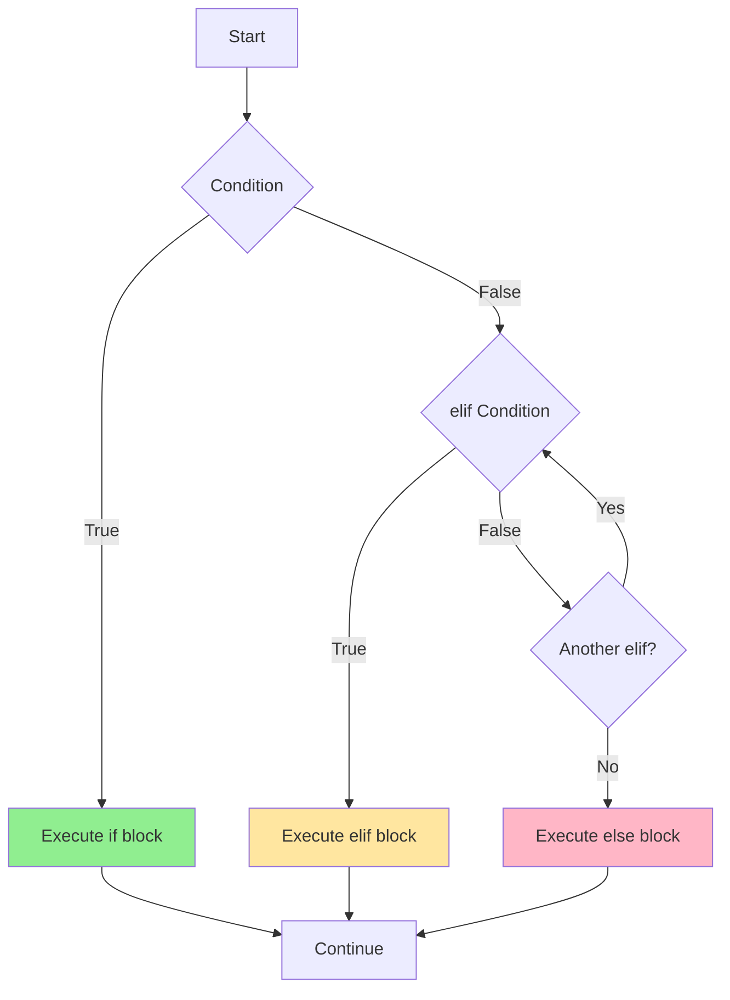

#### Ternary Operator (Conditional Expression)

```python
# Syntax: value_if_true if condition else value_if_false
x = 10
result = "positive" if x > 0 else "non-positive"

# Nested ternary (avoid if possible - hard to read)
x = 0
result = "positive" if x > 0 else "zero" if x == 0 else "negative"

# Practical use: default values
name = input("Enter name: ")
display_name = name if name else "Guest"

# In function calls
print("Even" if 10 % 2 == 0 else "Odd")
```

#### Truthiness in Conditionals

```python
# Falsy values: False, None, 0, 0.0, '', [], {}, set()
# Everything else is truthy

# Check if list is empty
my_list = []
if my_list:  # Pythonic way
    print("List has items")
else:
    print("List is empty")

# Don't do this (unpythonic)
if len(my_list) == 0:  # Works but not idiomatic
    print("List is empty")

# Check if string is non-empty
text = ""
if text:
    print("Text is not empty")

# Check for None
value = None
if value is None:  # Use 'is' for None
    print("Value is None")

# Walrus operator (Python 3.8+) - assignment in condition
if (n := len([1, 2, 3, 4])) > 3:
    print(f"List has {n} items")
```

### Loops

#### The `for` Loop

Iterates over sequences (lists, tuples, strings, etc.).

```python
# Basic for loop
fruits = ['apple', 'banana', 'cherry']
for fruit in fruits:
    print(fruit)

# Iterate over string
for char in "Python":
    print(char)

# Iterate over range
for i in range(5):
    print(i)  # 0, 1, 2, 3, 4

# Range with start, stop, step
for i in range(2, 10, 2):
    print(i)  # 2, 4, 6, 8

# Iterate with index using enumerate
for index, fruit in enumerate(fruits):
    print(f"{index}: {fruit}")

# Start enumeration from 1
for index, fruit in enumerate(fruits, start=1):
    print(f"{index}. {fruit}")

# Iterate over dictionary
person = {'name': 'Alice', 'age': 30, 'city': 'NYC'}

# Keys (default)
for key in person:
    print(key)

# Values
for value in person.values():
    print(value)

# Key-value pairs
for key, value in person.items():
    print(f"{key}: {value}")

# Iterate over multiple sequences with zip
names = ['Alice', 'Bob', 'Charlie']
ages = [30, 25, 35]
for name, age in zip(names, ages):
    print(f"{name} is {age} years old")

# Nested loops
matrix = [[1, 2, 3], [4, 5, 6], [7, 8, 9]]
for row in matrix:
    for element in row:
        print(element, end=' ')
    print()  # New line after each row
```

#### The `while` Loop

Repeats as long as condition is true.

```python
# Basic while loop
count = 0
while count < 5:
    print(count)
    count += 1

# Input validation
while True:
    user_input = input("Enter 'quit' to exit: ")
    if user_input == 'quit':
        break
    print(f"You entered: {user_input}")

# Sentinel-controlled loop
total = 0
number = int(input("Enter number (0 to stop): "))
while number != 0:
    total += number
    number = int(input("Enter number (0 to stop): "))
print(f"Total: {total}")

# Be careful with infinite loops!
# while True:
#     print("This runs forever!")  # Don't do this without a break
```

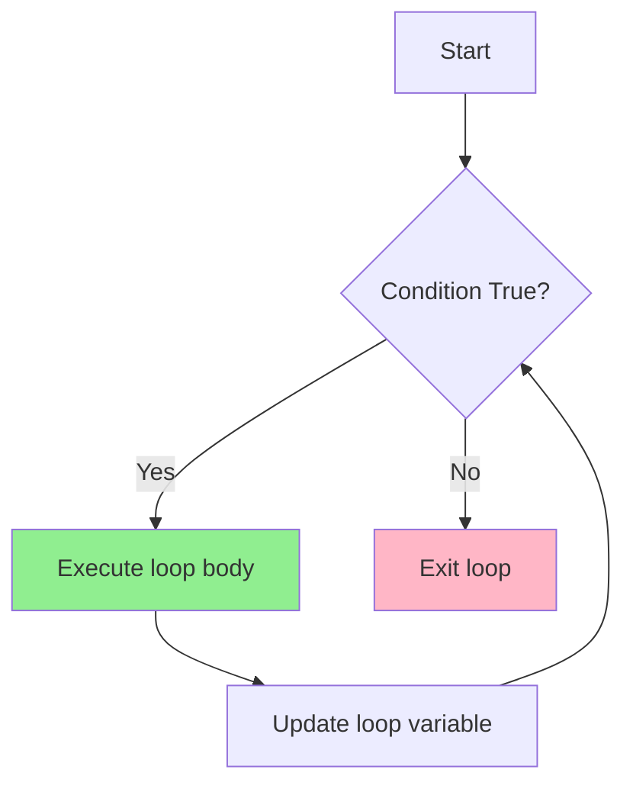

#### Loop Control Statements

```python
# break - exit loop immediately
for i in range(10):
    if i == 5:
        break  # Loop terminates when i is 5
    print(i)  # Prints 0, 1, 2, 3, 4

# continue - skip current iteration
for i in range(10):
    if i % 2 == 0:
        continue  # Skip even numbers
    print(i)  # Prints 1, 3, 5, 7, 9

# else clause - executes if loop completes normally (no break)
for i in range(5):
    print(i)
else:
    print("Loop completed normally")  # This executes

# With break - else doesn't execute
for i in range(5):
    if i == 3:
        break
    print(i)
else:
    print("This won't print")  # Skipped because of break

# pass - placeholder (does nothing)
for i in range(5):
    pass  # TODO: implement later
```

#### Practical Loop Patterns

```python
# 1. Find first element matching condition
numbers = [1, 3, 5, 7, 8, 10, 12]
for num in numbers:
    if num % 2 == 0:
        print(f"First even number: {num}")
        break
else:
    print("No even numbers found")

# 2. Count occurrences
text = "hello world"
count = 0
for char in text:
    if char == 'l':
        count += 1
print(f"'l' appears {count} times")

# Better: use count method
print(text.count('l'))

# 3. Build a new list (list comprehension is better)
squares = []
for x in range(10):
    squares.append(x**2)

# Better:
squares = [x**2 for x in range(10)]

# 4. Iterate in reverse
for i in range(9, -1, -1):
    print(i)  # 9, 8, 7, ..., 0

# Or use reversed()
for num in reversed([1, 2, 3, 4, 5]):
    print(num)  # 5, 4, 3, 2, 1

# 5. Parallel iteration with multiple lists
names = ['Alice', 'Bob', 'Charlie']
ages = [30, 25, 35]
cities = ['NYC', 'LA', 'Chicago']

for name, age, city in zip(names, ages, cities):
    print(f"{name}, {age}, from {city}")
```

### Pattern Matching (Python 3.10+)

The `match` statement provides structural pattern matching.

```python
# Basic match-case (like switch in other languages)
def http_status(status):
    match status:
        case 200:
            return "OK"
        case 404:
            return "Not Found"
        case 500:
            return "Internal Server Error"
        case _:  # Default case (wildcard)
            return "Unknown status"

print(http_status(200))  # "OK"
print(http_status(999))  # "Unknown status"

# Pattern matching with multiple values
def day_type(day):
    match day:
        case "Saturday" | "Sunday":
            return "Weekend"
        case "Monday" | "Tuesday" | "Wednesday" | "Thursday" | "Friday":
            return "Weekday"
        case _:
            return "Invalid day"

# Matching sequences
def process_command(command):
    match command:
        case ["quit"]:
            print("Quitting...")
        case ["load", filename]:
            print(f"Loading {filename}")
        case ["save", filename]:
            print(f"Saving to {filename}")
        case ["load", *files]:  # Match multiple items
            print(f"Loading multiple files: {files}")
        case _:
            print("Unknown command")

process_command(["load", "data.txt"])  # Loading data.txt
process_command(["load", "a.txt", "b.txt"])  # Loading multiple files: ['a.txt', 'b.txt']

# Matching dictionaries
def process_user(user):
    match user:
        case {"name": name, "age": age} if age >= 18:
            print(f"{name} is an adult")
        case {"name": name, "age": age}:
            print(f"{name} is a minor")
        case {"name": name}:
            print(f"Age not provided for {name}")
        case _:
            print("Invalid user data")

process_user({"name": "Alice", "age": 30})  # Alice is an adult

# Matching objects/classes
from dataclasses import dataclass

@dataclass
class Point:
    x: int
    y: int

def describe_point(point):
    match point:
        case Point(x=0, y=0):
            print("Origin")
        case Point(x=0, y=y):
            print(f"On Y-axis at {y}")
        case Point(x=x, y=0):
            print(f"On X-axis at {x}")
        case Point(x=x, y=y) if x == y:
            print(f"On diagonal at ({x}, {y})")
        case Point(x=x, y=y):
            print(f"At ({x}, {y})")

describe_point(Point(0, 0))    # Origin
describe_point(Point(0, 5))    # On Y-axis at 5
describe_point(Point(3, 3))    # On diagonal at (3, 3)
```

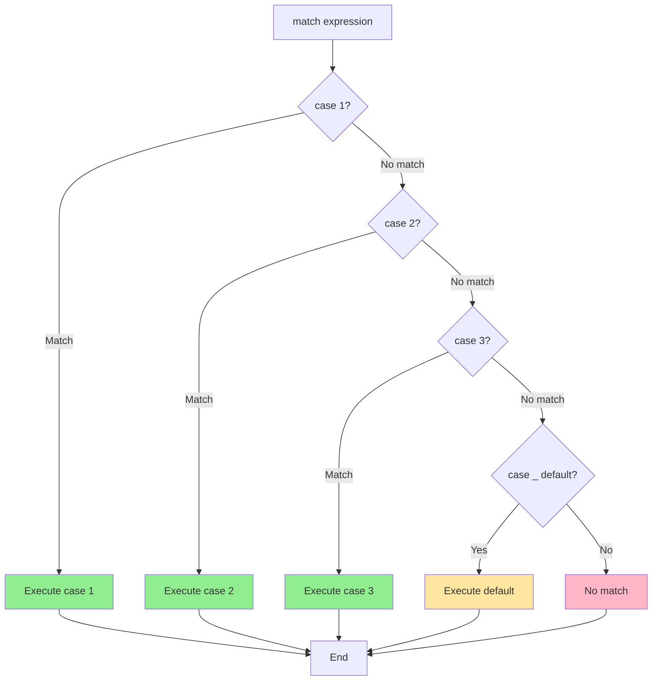

### Comprehensions (Compact Control Flow)

#### List Comprehension

```python
# Basic list comprehension
squares = [x**2 for x in range(10)]
# [0, 1, 4, 9, 16, 25, 36, 49, 64, 81]

# With condition
evens = [x for x in range(10) if x % 2 == 0]
# [0, 2, 4, 6, 8]

# With if-else (ternary)
labels = ["even" if x % 2 == 0 else "odd" for x in range(5)]
# ['even', 'odd', 'even', 'odd', 'even']

# Nested comprehension
matrix = [[i*j for j in range(3)] for i in range(3)]
# [[0, 0, 0], [0, 1, 2], [0, 2, 4]]

# Flatten nested list
nested = [[1, 2, 3], [4, 5, 6], [7, 8, 9]]
flat = [num for row in nested for num in row]
# [1, 2, 3, 4, 5, 6, 7, 8, 9]
```

#### Dictionary Comprehension

```python
# Basic dict comprehension
squares = {x: x**2 for x in range(5)}
# {0: 0, 1: 1, 2: 4, 3: 9, 4: 16}

# Swap keys and values
original = {'a': 1, 'b': 2, 'c': 3}
swapped = {v: k for k, v in original.items()}
# {1: 'a', 2: 'b', 3: 'c'}

# With condition
scores = {'Alice': 85, 'Bob': 92, 'Charlie': 78, 'David': 95}
high_scores = {name: score for name, score in scores.items() if score >= 90}
# {'Bob': 92, 'David': 95}
```

#### Set Comprehension

```python
# Basic set comprehension
squares = {x**2 for x in range(-5, 6)}
# {0, 1, 4, 9, 16, 25} (duplicates removed)

# Extract unique characters
text = "hello world"
unique_chars = {char for char in text if char != ' '}
# {'h', 'e', 'l', 'o', 'w', 'r', 'd'}
```

#### Generator Expression

```python
# Generator expression (uses parentheses)
squares_gen = (x**2 for x in range(10))
# <generator object at 0x...>

# Lazy evaluation - values computed on demand
for square in squares_gen:
    print(square)

# Memory efficient for large datasets
sum_of_squares = sum(x**2 for x in range(1000000))  # No list created!
```

### Practical Example: Control Flow in Action

```python
# Example: Process student grades
students = [
    {"name": "Alice", "score": 85},
    {"name": "Bob", "score": 92},
    {"name": "Charlie", "score": 78},
    {"name": "David", "score": 65},
    {"name": "Eve", "score": 95}
]

# Task 1: Assign grades
for student in students:
    score = student["score"]
    if score >= 90:
        grade = 'A'
    elif score >= 80:
        grade = 'B'
    elif score >= 70:
        grade = 'C'
    elif score >= 60:
        grade = 'D'
    else:
        grade = 'F'
    student["grade"] = grade
    print(f"{student['name']}: {score} ({grade})")

# Task 2: Find top scorer
top_student = None
top_score = 0
for student in students:
    if student["score"] > top_score:
        top_score = student["score"]
        top_student = student["name"]
print(f"\nTop student: {top_student} with {top_score}")

# Task 3: Calculate average (with comprehension)
average = sum(s["score"] for s in students) / len(students)
print(f"Average score: {average:.2f}")

# Task 4: Students above average
above_avg = [s["name"] for s in students if s["score"] > average]
print(f"Above average: {', '.join(above_avg)}")
```

### Interview Insight: Why This Matters

Understanding control flow helps you:

- Write clean, readable code
- Choose the right loop construct
- Optimize performance (e.g., break early)
- Use comprehensions for concise code

Common interview questions from this section:

- "What's the difference between `break` and `continue`?"
- "Explain the `else` clause in loops"
- "When would you use a `while` loop vs a `for` loop?"
- "What are list comprehensions and when should you use them?"
- "Explain pattern matching in Python 3.10+"
- "How do you iterate over multiple lists simultaneously?"

---

## Functions and Functional Concepts

### Overview

Functions are reusable blocks of code that perform specific tasks. Python supports various function types and functional programming concepts.

### Function Basics

#### Defining Functions

```python
# Basic function
def greet():
    print("Hello!")

greet()  # Call the function

# Function with parameters
def greet_person(name):
    print(f"Hello, {name}!")

greet_person("Alice")

# Function with return value
def add(a, b):
    return a + b

result = add(3, 5)
print(result)  # 8

# Multiple return values (returns tuple)
def get_coordinates():
    return 10, 20

x, y = get_coordinates()  # Unpacking
print(x, y)  # 10 20

# Early return
def is_even(n):
    if n % 2 == 0:
        return True
    return False

# More concise
def is_even(n):
    return n % 2 == 0
```

#### Function Parameters

```python
# Positional parameters
def greet(first_name, last_name):
    print(f"Hello, {first_name} {last_name}!")

greet("John", "Doe")

# Keyword arguments
greet(last_name="Doe", first_name="John")  # Order doesn't matter

# Default parameters
def greet(name, greeting="Hello"):
    print(f"{greeting}, {name}!")

greet("Alice")           # Hello, Alice!
greet("Bob", "Hi")       # Hi, Bob!
greet("Charlie", greeting="Hey")  # Hey, Charlie!

# IMPORTANT: Default values evaluated once at function definition
def append_to_list(item, lst=[]):  # DANGEROUS!
    lst.append(item)
    return lst

print(append_to_list(1))  # [1]
print(append_to_list(2))  # [1, 2] - Same list!

# Correct way:
def append_to_list(item, lst=None):
    if lst is None:
        lst = []
    lst.append(item)
    return lst

print(append_to_list(1))  # [1]
print(append_to_list(2))  # [2] - New list!

# *args - variable positional arguments
def sum_all(*args):
    return sum(args)

print(sum_all(1, 2, 3))        # 6
print(sum_all(1, 2, 3, 4, 5))  # 15

# **kwargs - variable keyword arguments
def print_info(**kwargs):
    for key, value in kwargs.items():
        print(f"{key}: {value}")

print_info(name="Alice", age=30, city="NYC")

# Combining all parameter types
def complex_function(pos1, pos2, *args, kwonly1, kwonly2="default", **kwargs):
    print(f"Positional: {pos1}, {pos2}")
    print(f"*args: {args}")
    print(f"Keyword-only: {kwonly1}, {kwonly2}")
    print(f"**kwargs: {kwargs}")

complex_function(1, 2, 3, 4, kwonly1="required", extra="extra_value")

# Position-only parameters (Python 3.8+)
def func(a, b, /, c, d, *, e, f):
    # a, b are position-only (before /)
    # c, d can be positional or keyword
    # e, f are keyword-only (after *)
    pass

func(1, 2, 3, 4, e=5, f=6)       # Valid
# func(a=1, b=2, c=3, d=4, e=5, f=6)  # Invalid - a, b position-only
```

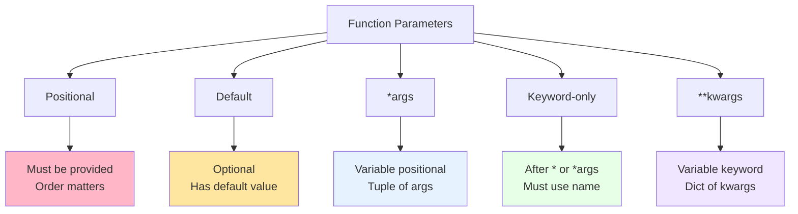

#### Function Annotations (Type Hints)

```python
# Type hints (Python 3.5+)
def greet(name: str) -> str:
    return f"Hello, {name}!"

def add(a: int, b: int) -> int:
    return a + b

# Complex types
from typing import List, Dict, Tuple, Optional, Union

def process_items(items: List[int]) -> int:
    return sum(items)

def get_user(user_id: int) -> Optional[Dict[str, str]]:
    # Returns dict or None
    if user_id == 1:
        return {"name": "Alice", "email": "alice@example.com"}
    return None

def handle_input(value: Union[int, str]) -> str:
    # Accepts int or str
    return str(value)

# Note: Type hints are NOT enforced at runtime!
# Use tools like mypy for static type checking
```

### Scope and Lifetime

#### LEGB Rule (Revisited with Functions)

```python
x = "global"

def outer():
    x = "enclosing"

    def inner():
        x = "local"
        print(f"Inner: {x}")  # local

    inner()
    print(f"Outer: {x}")  # enclosing

outer()
print(f"Global: {x}")  # global

# Modifying enclosing scope with nonlocal
def counter():
    count = 0

    def increment():
        nonlocal count  # Modify enclosing scope
        count += 1
        return count

    return increment

c = counter()
print(c())  # 1
print(c())  # 2
print(c())  # 3

# Modifying global scope with global
counter = 0

def increment():
    global counter  # Modify global variable
    counter += 1

increment()
increment()
print(counter)  # 2
```

### Lambda Functions

Anonymous, single-expression functions.

```python
# Basic lambda
add = lambda x, y: x + y
print(add(3, 5))  # 8

# Lambda with single parameter
square = lambda x: x**2
print(square(4))  # 16

# Common use: with higher-order functions
numbers = [1, 2, 3, 4, 5]
squared = list(map(lambda x: x**2, numbers))
print(squared)  # [1, 4, 9, 16, 25]

# Filter with lambda
evens = list(filter(lambda x: x % 2 == 0, numbers))
print(evens)  # [2, 4]

# Sort with lambda (custom key)
students = [
    {"name": "Alice", "age": 25},
    {"name": "Bob", "age": 20},
    {"name": "Charlie", "age": 30}
]
students.sort(key=lambda s: s["age"])
print([s["name"] for s in students])  # ['Bob', 'Alice', 'Charlie']

# Lambda limitations: single expression only, no statements
# Can't do: lambda x: print(x)  # Invalid
# Can't do: lambda x: if x > 0: return x  # Invalid

# When to use lambda:
# - Short, simple operations
# - As argument to higher-order functions
# - When defining a named function is overkill

# When NOT to use lambda:
# - Complex logic (use def instead)
# - When you need multiple statements
# - When readability suffers
```

### Higher-Order Functions

Functions that take functions as arguments or return functions.

```python
# map() - apply function to each element
numbers = [1, 2, 3, 4, 5]
squared = list(map(lambda x: x**2, numbers))
print(squared)  # [1, 4, 9, 16, 25]

# Multiple iterables
list1 = [1, 2, 3]
list2 = [4, 5, 6]
sums = list(map(lambda x, y: x + y, list1, list2))
print(sums)  # [5, 7, 9]

# filter() - keep elements where function returns True
numbers = [1, 2, 3, 4, 5, 6, 7, 8, 9, 10]
evens = list(filter(lambda x: x % 2 == 0, numbers))
print(evens)  # [2, 4, 6, 8, 10]

# reduce() - apply function cumulatively
from functools import reduce
numbers = [1, 2, 3, 4, 5]
product = reduce(lambda x, y: x * y, numbers)
print(product)  # 120 (1*2*3*4*5)

# Function returning function
def make_multiplier(n):
    def multiplier(x):
        return x * n
    return multiplier

times_two = make_multiplier(2)
times_three = make_multiplier(3)

print(times_two(5))    # 10
print(times_three(5))  # 15

# Function as parameter
def apply_operation(x, y, operation):
    return operation(x, y)

print(apply_operation(5, 3, lambda a, b: a + b))  # 8
print(apply_operation(5, 3, lambda a, b: a * b))  # 15
```

### Decorators

Functions that modify the behavior of other functions.

```python
# Basic decorator
def my_decorator(func):
    def wrapper():
        print("Before function call")
        func()
        print("After function call")
    return wrapper

@my_decorator
def say_hello():
    print("Hello!")

say_hello()
# Output:
# Before function call
# Hello!
# After function call

# Equivalent to:
# say_hello = my_decorator(say_hello)

# Decorator with arguments
def my_decorator(func):
    def wrapper(*args, **kwargs):
        print(f"Calling {func.__name__}")
        result = func(*args, **kwargs)
        print(f"Finished {func.__name__}")
        return result
    return wrapper

@my_decorator
def add(a, b):
    return a + b

result = add(3, 5)  # Prints decorating messages
print(result)  # 8

# Preserve function metadata with functools.wraps
from functools import wraps

def my_decorator(func):
    @wraps(func)  # Preserves func.__name__, func.__doc__, etc.
    def wrapper(*args, **kwargs):
        return func(*args, **kwargs)
    return wrapper

# Decorator with parameters
def repeat(times):
    def decorator(func):
        @wraps(func)
        def wrapper(*args, **kwargs):
            for _ in range(times):
                result = func(*args, **kwargs)
            return result
        return wrapper
    return decorator

@repeat(3)
def greet(name):
    print(f"Hello, {name}!")

greet("Alice")
# Output (3 times):
# Hello, Alice!
# Hello, Alice!
# Hello, Alice!

# Common decorator patterns

# 1. Timing decorator
import time

def timer(func):
    @wraps(func)
    def wrapper(*args, **kwargs):
        start = time.time()
        result = func(*args, **kwargs)
        end = time.time()
        print(f"{func.__name__} took {end - start:.4f} seconds")
        return result
    return wrapper

@timer
def slow_function():
    time.sleep(1)

slow_function()  # Prints execution time

# 2. Caching decorator (memoization)
def memoize(func):
    cache = {}
    @wraps(func)
    def wrapper(*args):
        if args not in cache:
            cache[args] = func(*args)
        return cache[args]
    return wrapper

@memoize
def fibonacci(n):
    if n < 2:
        return n
    return fibonacci(n-1) + fibonacci(n-2)

print(fibonacci(100))  # Fast due to caching!

# Or use built-in functools.lru_cache
from functools import lru_cache

@lru_cache(maxsize=None)
def fibonacci(n):
    if n < 2:
        return n
    return fibonacci(n-1) + fibonacci(n-2)
```

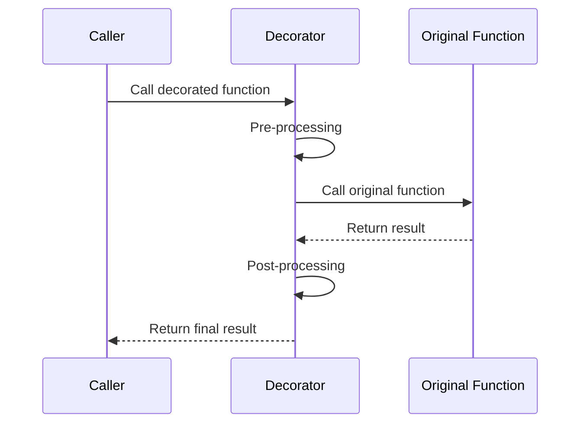

### Closures

Functions that remember values from enclosing scope.

```python
# Basic closure
def outer(x):
    def inner(y):
        return x + y  # 'inner' remembers 'x'
    return inner

add_five = outer(5)
print(add_five(3))  # 8
print(add_five(10)) # 15

# Closure retains state
def make_counter():
    count = 0

    def counter():
        nonlocal count
        count += 1
        return count

    return counter

counter1 = make_counter()
counter2 = make_counter()

print(counter1())  # 1
print(counter1())  # 2
print(counter2())  # 1 (separate state)
print(counter1())  # 3

# Checking closure variables
def outer(x):
    def inner(y):
        return x + y
    return inner

f = outer(5)
print(f.__closure__)  # (<cell at 0x...: int object at 0x...>,)
print(f.__closure__[0].cell_contents)  # 5
```

### Generators (Preview)

Functions that yield values instead of returning.

```python
# Generator function
def count_up_to(n):
    count = 1
    while count <= n:
        yield count  # Yields value and pauses
        count += 1

counter = count_up_to(5)
print(next(counter))  # 1
print(next(counter))  # 2

# Or use in loop
for num in count_up_to(3):
    print(num)  # 1, 2, 3

# Generator expression (covered more in later section)
squares = (x**2 for x in range(10))
```

### Practical Example: Function Composition

```python
# Example: Data processing pipeline

def clean_text(text):
    """Remove extra whitespace"""
    return ' '.join(text.split())

def lowercase(text):
    """Convert to lowercase"""
    return text.lower()

def remove_punctuation(text):
    """Remove punctuation"""
    import string
    return text.translate(str.maketrans('', '', string.punctuation))

# Compose functions
def process_text(text):
    text = clean_text(text)
    text = lowercase(text)
    text = remove_punctuation(text)
    return text

text = "  Hello,   WORLD!  How  are   you?  "
result = process_text(text)
print(result)  # "hello world how are you"

# Generic function composition
def compose(*functions):
    def composed(value):
        for func in reversed(functions):
            value = func(value)
        return value
    return composed

process = compose(remove_punctuation, lowercase, clean_text)
result = process("  Hello,   WORLD!  ")
print(result)  # "hello world"
```

### Interview Insight: Why This Matters

Understanding functions helps you:

- Write modular, reusable code
- Understand scope and closures
- Use functional programming patterns
- Create flexible, composable APIs

Common interview questions from this section:

- "Explain the difference between parameters and arguments"
- "What are \*args and \*\*kwargs?"
- "What is a closure? Give an example"
- "Explain how decorators work"
- "What's the difference between a function and a lambda?"
- "What are higher-order functions?"
- "Explain the LEGB rule for scope resolution"

---

## Object-Oriented Programming

### Overview

Object-Oriented Programming (OOP) organizes code into objects that combine data (attributes) and behavior (methods). Python fully supports OOP with classes and objects.

### Classes and Objects

#### Basic Class Definition

```python
# Simple class
class Dog:
    # Class attribute (shared by all instances)
    species = "Canis familiaris"

    # Constructor (initializer)
    def __init__(self, name, age):
        # Instance attributes (unique to each instance)
        self.name = name
        self.age = age

    # Instance method
    def bark(self):
        return f"{self.name} says Woof!"

    # Method with parameters
    def celebrate_birthday(self):
        self.age += 1
        return f"{self.name} is now {self.age} years old!"

# Create objects (instances)
dog1 = Dog("Buddy", 3)
dog2 = Dog("Lucy", 5)

# Access attributes
print(dog1.name)  # "Buddy"
print(dog1.age)   # 3
print(dog1.species)  # "Canis familiaris"

# Call methods
print(dog1.bark())  # "Buddy says Woof!"
print(dog1.celebrate_birthday())  # "Buddy is now 4 years old!"

# Class attributes are shared
print(dog1.species)  # "Canis familiaris"
print(dog2.species)  # "Canis familiaris"
Dog.species = "Dog"
print(dog1.species)  # "Dog" (changed for all instances)
```

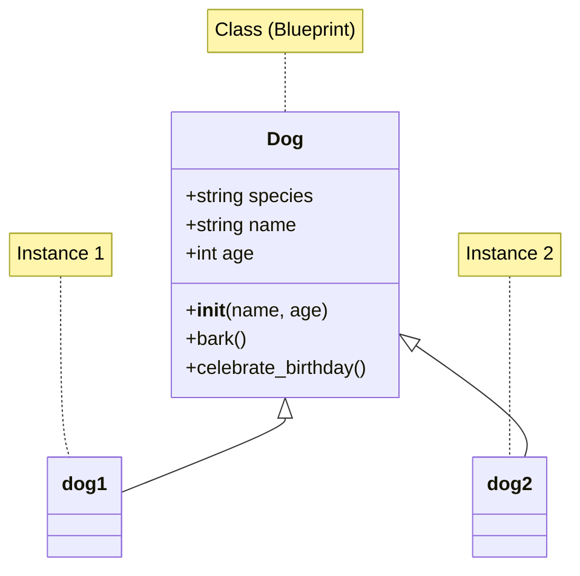

#### The `self` Parameter

```python
# 'self' refers to the instance calling the method
class Counter:
    def __init__(self):
        self.count = 0

    def increment(self):
        self.count += 1  # Modifies THIS instance's count

    def get_count(self):
        return self.count

c1 = Counter()
c2 = Counter()

c1.increment()
c1.increment()
c2.increment()

print(c1.get_count())  # 2
print(c2.get_count())  # 1 (separate state)

# Note: 'self' is convention, not keyword
class Example:
    def method(this):  # Can use any name (but don't!)
        return this
```

#### Class Methods and Static Methods

```python
class MyClass:
    class_variable = 0

    def __init__(self, value):
        self.value = value

    # Instance method (needs self)
    def instance_method(self):
        return f"Instance value: {self.value}"

    # Class method (receives class as first parameter)
    @classmethod
    def class_method(cls):
        cls.class_variable += 1
        return f"Class variable: {cls.class_variable}"

    # Static method (doesn't receive self or cls)
    @staticmethod
    def static_method(x, y):
        return x + y

    # Alternative constructor using class method
    @classmethod
    def from_string(cls, string_value):
        return cls(int(string_value))

# Instance method requires instance
obj = MyClass(10)
print(obj.instance_method())  # "Instance value: 10"

# Class method can be called on class or instance
print(MyClass.class_method())  # "Class variable: 1"
print(obj.class_method())      # "Class variable: 2"

# Static method can be called on class or instance
print(MyClass.static_method(5, 3))  # 8
print(obj.static_method(5, 3))      # 8

# Alternative constructor
obj2 = MyClass.from_string("42")
print(obj2.value)  # 42
```

### Encapsulation and Access Control

Python doesn't have true private attributes, but uses conventions.

```python
class BankAccount:
    def __init__(self, owner, balance):
        self.owner = owner          # Public
        self._balance = balance     # Protected (convention: internal use)
        self.__account_id = "123"   # Private (name mangling)

    def deposit(self, amount):
        if amount > 0:
            self._balance += amount

    def get_balance(self):
        return self._balance

    def __str__(self):
        return f"Account of {self.owner}: ${self._balance}"

account = BankAccount("Alice", 1000)

# Public attribute - directly accessible
print(account.owner)  # "Alice"

# Protected attribute - accessible but shouldn't be used externally
print(account._balance)  # 1000 (works, but discouraged)

# Private attribute - name mangling
# print(account.__account_id)  # AttributeError
print(account._BankAccount__account_id)  # "123" (name mangled, but still accessible)

# Use methods to interact with data
account.deposit(500)
print(account.get_balance())  # 1500
```

### Properties (Getters and Setters)

```python
# Without properties (Java-style)
class Person:
    def __init__(self, name, age):
        self._name = name
        self._age = age

    def get_age(self):
        return self._age

    def set_age(self, age):
        if age < 0:
            raise ValueError("Age cannot be negative")
        self._age = age

# With properties (Pythonic)
class Person:
    def __init__(self, name, age):
        self.name = name
        self.age = age  # Uses setter

    @property
    def age(self):
        """Getter"""
        return self._age

    @age.setter
    def age(self, value):
        """Setter with validation"""
        if value < 0:
            raise ValueError("Age cannot be negative")
        self._age = value

    @age.deleter
    def age(self):
        """Deleter"""
        del self._age

person = Person("Alice", 30)
print(person.age)  # 30 (uses getter)

person.age = 31    # Uses setter
print(person.age)  # 31

# person.age = -5  # ValueError: Age cannot be negative

# Read-only property (no setter)
class Circle:
    def __init__(self, radius):
        self.radius = radius

    @property
    def area(self):
        return 3.14159 * self.radius ** 2

    @property
    def diameter(self):
        return self.radius * 2

circle = Circle(5)
print(circle.area)      # 78.53975 (computed)
print(circle.diameter)  # 10
# circle.area = 100  # AttributeError (read-only)
```

### Inheritance

```python
# Base class (parent/superclass)
class Animal:
    def __init__(self, name, species):
        self.name = name
        self.species = species

    def make_sound(self):
        return "Some generic sound"

    def info(self):
        return f"{self.name} is a {self.species}"

# Derived class (child/subclass)
class Dog(Animal):
    def __init__(self, name, breed):
        super().__init__(name, "Dog")  # Call parent constructor
        self.breed = breed

    # Override parent method
    def make_sound(self):
        return "Woof!"

    # Add new method
    def fetch(self):
        return f"{self.name} is fetching!"

class Cat(Animal):
    def __init__(self, name, indoor):
        super().__init__(name, "Cat")
        self.indoor = indoor

    def make_sound(self):
        return "Meow!"

# Using inheritance
dog = Dog("Buddy", "Golden Retriever")
cat = Cat("Whiskers", True)

print(dog.info())         # "Buddy is a Dog" (inherited method)
print(dog.make_sound())   # "Woof!" (overridden method)
print(dog.fetch())        # "Buddy is fetching!" (new method)

print(cat.make_sound())   # "Meow!"

# Check inheritance
print(isinstance(dog, Dog))     # True
print(isinstance(dog, Animal))  # True
print(isinstance(dog, Cat))     # False

print(issubclass(Dog, Animal))  # True
print(issubclass(Dog, Cat))     # False
```

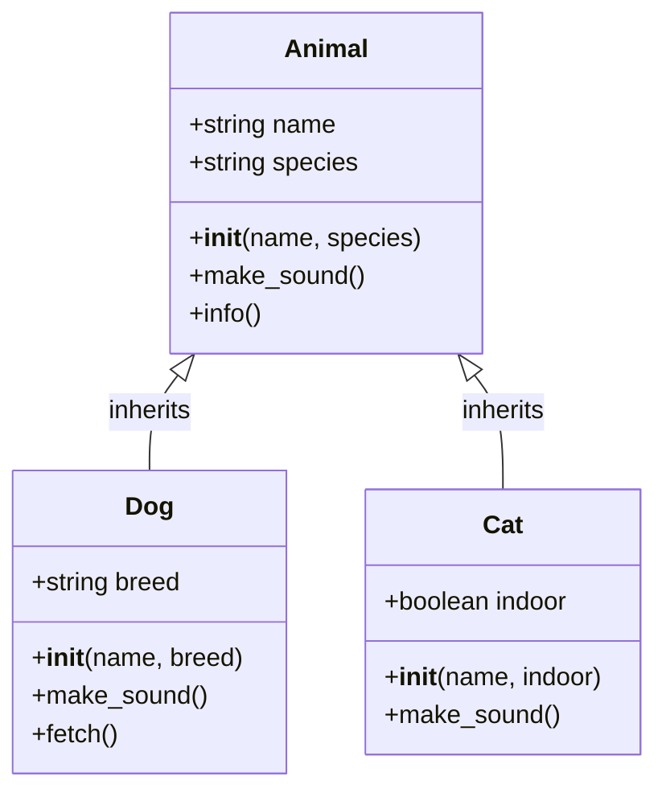

#### Multiple Inheritance

```python
# Multiple inheritance (use with caution!)
class Flyable:
    def fly(self):
        return "Flying!"

class Swimmable:
    def swim(self):
        return "Swimming!"

class Duck(Flyable, Swimmable):
    def __init__(self, name):
        self.name = name

    def quack(self):
        return "Quack!"

duck = Duck("Donald")
print(duck.fly())    # "Flying!" (from Flyable)
print(duck.swim())   # "Swimming!" (from Swimmable)
print(duck.quack())  # "Quack!" (own method)

# Method Resolution Order (MRO)
print(Duck.__mro__)
# (<class 'Duck'>, <class 'Flyable'>, <class 'Swimmable'>, <class 'object'>)

# Diamond problem
class A:
    def method(self):
        return "A"

class B(A):
    def method(self):
        return "B"

class C(A):
    def method(self):
        return "C"

class D(B, C):
    pass

d = D()
print(d.method())  # "B" (follows MRO: D -> B -> C -> A)
print(D.__mro__)
```

### Polymorphism

```python
# Polymorphism - different classes with same interface
class Shape:
    def area(self):
        pass

    def perimeter(self):
        pass

class Rectangle(Shape):
    def __init__(self, width, height):
        self.width = width
        self.height = height

    def area(self):
        return self.width * self.height

    def perimeter(self):
        return 2 * (self.width + self.height)

class Circle(Shape):
    def __init__(self, radius):
        self.radius = radius

    def area(self):
        return 3.14159 * self.radius ** 2

    def perimeter(self):
        return 2 * 3.14159 * self.radius

# Polymorphic function
def print_shape_info(shape):
    print(f"Area: {shape.area()}")
    print(f"Perimeter: {shape.perimeter()}")

shapes = [Rectangle(5, 10), Circle(7)]

for shape in shapes:
    print_shape_info(shape)  # Works for any shape!

# Duck typing - "If it walks like a duck and quacks like a duck..."
class NotAShape:
    def area(self):
        return 42

    def perimeter(self):
        return 84

# Works even though NotAShape doesn't inherit from Shape!
print_shape_info(NotAShape())
```

### Magic Methods (Dunder Methods)

Special methods that define behavior for built-in operations.

```python
class Vector:
    def __init__(self, x, y):
        self.x = x
        self.y = y

    # String representation
    def __str__(self):
        """For print() and str()"""
        return f"Vector({self.x}, {self.y})"

    def __repr__(self):
        """For repr() and interactive console"""
        return f"Vector({self.x}, {self.y})"

    # Arithmetic operators
    def __add__(self, other):
        """v1 + v2"""
        return Vector(self.x + other.x, self.y + other.y)

    def __sub__(self, other):
        """v1 - v2"""
        return Vector(self.x - other.x, self.y - other.y)

    def __mul__(self, scalar):
        """v * scalar"""
        return Vector(self.x * scalar, self.y * scalar)

    # Comparison operators
    def __eq__(self, other):
        """v1 == v2"""
        return self.x == other.x and self.y == other.y

    def __lt__(self, other):
        """v1 < v2"""
        return self.magnitude() < other.magnitude()

    # Other magic methods
    def __len__(self):
        """len(v)"""
        return 2  # 2D vector

    def __getitem__(self, index):
        """v[0], v[1]"""
        if index == 0:
            return self.x
        elif index == 1:
            return self.y
        else:
            raise IndexError("Vector index out of range")

    def __call__(self):
        """v() - make object callable"""
        return self.magnitude()

    def magnitude(self):
        return (self.x**2 + self.y**2)**0.5

# Using magic methods
v1 = Vector(3, 4)
v2 = Vector(1, 2)

print(v1)           # Vector(3, 4) (__str__)
print(v1 + v2)      # Vector(4, 6) (__add__)
print(v1 - v2)      # Vector(2, 2) (__sub__)
print(v1 * 2)       # Vector(6, 8) (__mul__)
print(v1 == v2)     # False (__eq__)
print(v1 < v2)      # False (__lt__)
print(len(v1))      # 2 (__len__)
print(v1[0])        # 3 (__getitem__)
print(v1())         # 5.0 (__call__)

# Common magic methods:
# __init__: Constructor
# __str__: String for users
# __repr__: String for developers
# __add__, __sub__, __mul__, __truediv__: Arithmetic
# __eq__, __ne__, __lt__, __le__, __gt__, __ge__: Comparison
# __len__: Length
# __getitem__, __setitem__, __delitem__: Indexing
# __iter__, __next__: Iteration
# __enter__, __exit__: Context managers
# __call__: Make object callable
```

### Abstract Base Classes

```python
from abc import ABC, abstractmethod

# Abstract class (cannot be instantiated)
class Shape(ABC):
    @abstractmethod
    def area(self):
        pass

    @abstractmethod
    def perimeter(self):
        pass

    # Can have concrete methods too
    def description(self):
        return f"I am a shape with area {self.area()}"

# Cannot instantiate abstract class
# shape = Shape()  # TypeError

# Must implement all abstract methods
class Rectangle(Shape):
    def __init__(self, width, height):
        self.width = width
        self.height = height

    def area(self):
        return self.width * self.height

    def perimeter(self):
        return 2 * (self.width + self.height)

rect = Rectangle(5, 10)
print(rect.area())         # 50
print(rect.description())  # "I am a shape with area 50"
```

### Dataclasses (Python 3.7+)

Simplify class creation for data-holding classes.

```python
from dataclasses import dataclass, field
from typing import List

# Without dataclass
class PersonOld:
    def __init__(self, name, age, hobbies):
        self.name = name
        self.age = age
        self.hobbies = hobbies

    def __repr__(self):
        return f"Person(name={self.name}, age={self.age}, hobbies={self.hobbies})"

    def __eq__(self, other):
        return self.name == other.name and self.age == other.age

# With dataclass
@dataclass
class Person:
    name: str
    age: int
    hobbies: List[str] = field(default_factory=list)  # Mutable default

    def greet(self):
        return f"Hi, I'm {self.name}!"

# Automatic __init__, __repr__, __eq__, etc.
p1 = Person("Alice", 30, ["reading", "coding"])
p2 = Person("Bob", 25)

print(p1)  # Person(name='Alice', age=30, hobbies=['reading', 'coding'])
print(p1 == p2)  # False
print(p1.greet())  # "Hi, I'm Alice!"

# Additional options
@dataclass(frozen=True)  # Immutable
class ImmutablePerson:
    name: str
    age: int

# ip = ImmutablePerson("Charlie", 35)
# ip.age = 36  # FrozenInstanceError

@dataclass(order=True)  # Add comparison methods
class ComparablePerson:
    name: str
    age: int = field(compare=True)
    email: str = field(compare=False)  # Exclude from comparison

p1 = ComparablePerson("Alice", 30, "alice@example.com")
p2 = ComparablePerson("Bob", 25, "bob@example.com")
print(p1 > p2)  # True (compares by age)
```

### Practical Example: Bank Account System

```python
from abc import ABC, abstractmethod
from datetime import datetime

class Account(ABC):
    """Abstract base class for bank accounts"""

    account_count = 0  # Class variable

    def __init__(self, owner, balance=0):
        self.owner = owner
        self._balance = balance
        self._transactions = []
        Account.account_count += 1
        self.account_number = Account.account_count

    @abstractmethod
    def withdraw(self, amount):
        """Must be implemented by subclasses"""
        pass

    def deposit(self, amount):
        if amount > 0:
            self._balance += amount
            self._add_transaction("Deposit", amount)
            return True
        return False

    def get_balance(self):
        return self._balance

    def _add_transaction(self, type, amount):
        self._transactions.append({
            'type': type,
            'amount': amount,
            'timestamp': datetime.now()
        })

    def transaction_history(self):
        return self._transactions

    def __str__(self):
        return f"Account #{self.account_number} ({self.owner}): ${self._balance:.2f}"

class SavingsAccount(Account):
    """Savings account with interest"""

    interest_rate = 0.02  # 2% interest

    def withdraw(self, amount):
        if amount > 0 and amount <= self._balance:
            self._balance -= amount
            self._add_transaction("Withdrawal", amount)
            return True
        return False

    def apply_interest(self):
        interest = self._balance * self.interest_rate
        self._balance += interest
        self._add_transaction("Interest", interest)
        return interest

class CheckingAccount(Account):
    """Checking account with overdraft protection"""

    def __init__(self, owner, balance=0, overdraft_limit=500):
        super().__init__(owner, balance)
        self.overdraft_limit = overdraft_limit

    def withdraw(self, amount):
        if amount > 0 and amount <= self._balance + self.overdraft_limit:
            self._balance -= amount
            self._add_transaction("Withdrawal", amount)
            return True
        return False

# Using the system
savings = SavingsAccount("Alice", 1000)
checking = CheckingAccount("Bob", 500, overdraft_limit=200)

print(savings)   # Account #1 (Alice): $1000.00
print(checking)  # Account #2 (Bob): $500.00

savings.deposit(500)
print(savings)   # Account #1 (Alice): $1500.00

savings.withdraw(200)
print(savings)   # Account #1 (Alice): $1300.00

interest = savings.apply_interest()
print(f"Interest earned: ${interest:.2f}")  # Interest earned: $26.00

checking.withdraw(600)  # Uses overdraft
print(checking)  # Account #2 (Bob): $-100.00

print(f"Total accounts created: {Account.account_count}")
```

### Interview Insight: Why This Matters

Understanding OOP helps you:

- Design scalable, maintainable systems
- Model real-world entities as code
- Use inheritance and composition effectively
- Implement design patterns

Common interview questions from this section:

- "Explain the four pillars of OOP (Encapsulation, Inheritance, Polymorphism, Abstraction)"
- "What's the difference between class and instance variables?"
- "Explain the difference between `__str__` and `__repr__`"
- "What is method overriding vs method overloading?"
- "Explain the difference between composition and inheritance"
- "What is the purpose of `@classmethod` and `@staticmethod`?"
- "What are magic/dunder methods?"
- "Explain the MRO (Method Resolution Order) in multiple inheritance"

---

## Error and Exception Handling

### Overview

Exceptions are runtime errors that disrupt normal program flow. Python provides a robust exception handling mechanism to catch and handle errors gracefully.

### Exception Hierarchy

Python exceptions are organized in a hierarchy:

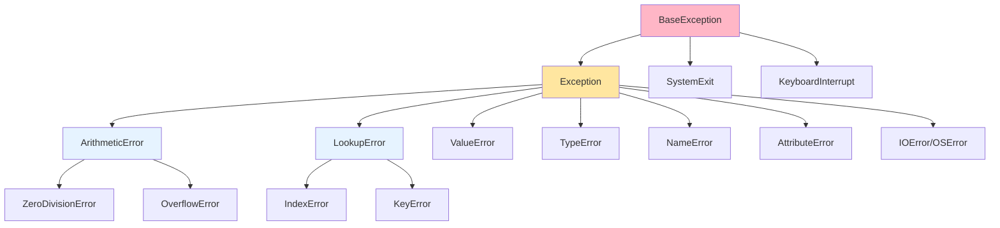

### Basic Exception Handling

#### try-except Block

```python
# Basic try-except
try:
    result = 10 / 0
except ZeroDivisionError:
    print("Cannot divide by zero!")

# Without exception handling
# result = 10 / 0  # ZeroDivisionError: division by zero

# Catching exception object
try:
    result = int("hello")
except ValueError as e:
    print(f"Error: {e}")  # Error: invalid literal for int() with base 10: 'hello'

# Multiple except blocks
try:
    numbers = [1, 2, 3]
    print(numbers[5])
except IndexError:
    print("Index out of range!")
except ValueError:
    print("Invalid value!")

# Catch multiple exceptions in one block
try:
    value = int(input("Enter a number: "))
    result = 10 / value
except (ValueError, ZeroDivisionError) as e:
    print(f"Error: {e}")

# Generic exception catch (use sparingly!)
try:
    # Some risky operation
    pass
except Exception as e:
    print(f"An error occurred: {e}")

# Bare except (NOT recommended - catches everything, even KeyboardInterrupt)
try:
    pass
except:
    print("Something went wrong")  # Too broad!
```

#### try-except-else

```python
# else block - executes if no exception occurs
try:
    result = 10 / 2
except ZeroDivisionError:
    print("Cannot divide by zero!")
else:
    print(f"Result: {result}")  # Executes only if no exception

# Practical use: separate error handling from success logic
def read_file(filename):
    try:
        f = open(filename, 'r')
    except FileNotFoundError:
        print(f"File {filename} not found")
    else:
        # Only runs if file opened successfully
        content = f.read()
        f.close()
        return content
```

#### try-except-finally

```python
# finally block - always executes, regardless of exceptions
try:
    f = open("data.txt", "r")
    content = f.read()
except FileNotFoundError:
    print("File not found")
finally:
    print("This always executes")
    # f.close()  # Resource cleanup

# Common pattern: cleanup resources
def process_file(filename):
    f = None
    try:
        f = open(filename, 'r')
        data = f.read()
        # Process data
        return data
    except FileNotFoundError:
        print(f"File {filename} not found")
        return None
    except Exception as e:
        print(f"Error processing file: {e}")
        return None
    finally:
        if f:
            f.close()  # Ensures file is closed

# Better: Use context manager (covered later)
```

### Raising Exceptions

#### raise Statement

```python
# Raise built-in exception
def divide(a, b):
    if b == 0:
        raise ZeroDivisionError("Cannot divide by zero!")
    return a / b

# try:
#     divide(10, 0)
# except ZeroDivisionError as e:
#     print(e)  # Cannot divide by zero!

# Raise with no argument (re-raise current exception)
def process_data(data):
    try:
        # Some operation
        result = int(data)
    except ValueError:
        print("Logging error...")
        raise  # Re-raises the ValueError

# try:
#     process_data("invalid")
# except ValueError:
#     print("Caught re-raised exception")

# Raise from another exception (exception chaining)
def load_config():
    try:
        with open("config.json") as f:
            import json
            return json.load(f)
    except FileNotFoundError as e:
        raise ValueError("Configuration file missing") from e

# try:
#     load_config()
# except ValueError as e:
#     print(e)
#     print(e.__cause__)  # Original FileNotFoundError
```

### Custom Exceptions

```python
# Basic custom exception
class CustomError(Exception):
    pass

raise CustomError("Something went wrong")

# Custom exception with additional attributes
class ValidationError(Exception):
    def __init__(self, message, field):
        super().__init__(message)
        self.field = field

def validate_age(age):
    if age < 0:
        raise ValidationError("Age cannot be negative", field="age")
    if age > 150:
        raise ValidationError("Age is unrealistic", field="age")

try:
    validate_age(-5)
except ValidationError as e:
    print(f"Validation error in field '{e.field}': {e}")

# Custom exception hierarchy
class DatabaseError(Exception):
    """Base class for database exceptions"""
    pass

class ConnectionError(DatabaseError):
    """Database connection failed"""
    pass

class QueryError(DatabaseError):
    """Database query failed"""
    pass

# Catch specific or base exception
try:
    raise QueryError("Invalid SQL syntax")
except DatabaseError as e:  # Catches all database errors
    print(f"Database error: {e}")
```

### Common Exception Patterns

```python
# 1. EAFP (Easier to Ask for Forgiveness than Permission) - Pythonic
# Try operation, handle exception if it fails
try:
    value = my_dict["key"]
except KeyError:
    value = None

# vs LBYL (Look Before You Leap) - Less Pythonic
if "key" in my_dict:
    value = my_dict["key"]
else:
    value = None

# 2. Converting exceptions
def safe_int(value):
    try:
        return int(value)
    except ValueError:
        return 0  # Default value instead of exception

# 3. Cleanup with try-finally
lock = threading.Lock()
lock.acquire()
try:
    # Critical section
    pass
finally:
    lock.release()  # Always release lock

# 4. Retrying with exceptions
def fetch_data_with_retry(url, max_retries=3):
    for attempt in range(max_retries):
        try:
            # Fetch data
            return data
        except NetworkError:
            if attempt == max_retries - 1:
                raise  # Re-raise on last attempt
            time.sleep(1)  # Wait before retry
```

### Context Managers (with statement)

Context managers ensure proper resource management.

```python
# Without context manager
f = open("file.txt", "r")
try:
    content = f.read()
finally:
    f.close()

# With context manager (better!)
with open("file.txt", "r") as f:
    content = f.read()
# File automatically closed after with block

# Multiple context managers
with open("input.txt", "r") as infile, open("output.txt", "w") as outfile:
    content = infile.read()
    outfile.write(content.upper())

# Creating custom context manager (class-based)
class FileManager:
    def __init__(self, filename, mode):
        self.filename = filename
        self.mode = mode
        self.file = None

    def __enter__(self):
        """Called when entering with block"""
        self.file = open(self.filename, self.mode)
        return self.file

    def __exit__(self, exc_type, exc_val, exc_tb):
        """Called when exiting with block"""
        if self.file:
            self.file.close()
        # Return False to propagate exceptions, True to suppress
        return False

with FileManager("test.txt", "w") as f:
    f.write("Hello, World!")

# Creating context manager (function-based)
from contextlib import contextmanager

@contextmanager
def file_manager(filename, mode):
    try:
        f = open(filename, mode)
        yield f  # Provides value to 'as' clause
    finally:
        f.close()

with file_manager("test.txt", "r") as f:
    content = f.read()

# Suppress exceptions with contextmanager
from contextlib import suppress

# Instead of:
try:
    os.remove("file.txt")
except FileNotFoundError:
    pass

# Use:
with suppress(FileNotFoundError):
    os.remove("file.txt")
```

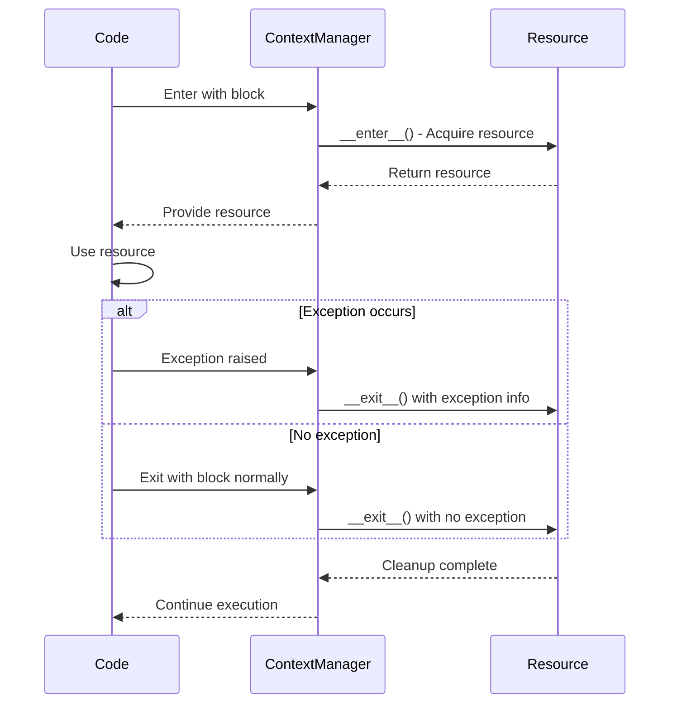

### Assertions

Assertions are debugging aids - not for handling runtime errors.

```python
# Basic assertion
x = 5
assert x > 0, "x must be positive"

# Assertions can be disabled with -O flag (python -O script.py)
# So NEVER use assertions for:
# - Input validation
# - Error handling
# - Business logic

# Bad: Using assertion for validation
def withdraw(amount):
    assert amount > 0  # BAD! Can be disabled
    # Process withdrawal

# Good: Raise exception for validation
def withdraw(amount):
    if amount <= 0:
        raise ValueError("Amount must be positive")
    # Process withdrawal

# Good: Use assertions for debugging
def calculate_average(numbers):
    assert len(numbers) > 0, "List should not be empty"  # Developer check
    return sum(numbers) / len(numbers)
```

### Exception Best Practices

```python
# 1. Be specific with exceptions
# Bad
try:
    value = int("hello")
except:  # Too broad
    pass

# Good
try:
    value = int("hello")
except ValueError:  # Specific
    pass

# 2. Don't silently ignore exceptions
# Bad
try:
    risky_operation()
except Exception:
    pass  # Silent failure - hard to debug

# Good
try:
    risky_operation()
except Exception as e:
    logger.error(f"Operation failed: {e}")
    # Or re-raise, or handle appropriately

# 3. Clean up resources
# Bad
f = open("file.txt")
data = f.read()
f.close()  # Might not execute if exception occurs

# Good
with open("file.txt") as f:
    data = f.read()

# 4. Provide context in exceptions
# Bad
raise ValueError()

# Good
raise ValueError(f"Invalid age: {age}. Must be between 0 and 150")

# 5. Use custom exceptions for domain logic
class InsufficientFundsError(Exception):
    pass

class BankAccount:
    def withdraw(self, amount):
        if amount > self.balance:
            raise InsufficientFundsError(
                f"Cannot withdraw ${amount}. Balance: ${self.balance}"
            )
```

### Practical Example: File Processing with Error Handling

```python
import json
import logging

# Setup logging
logging.basicConfig(level=logging.ERROR)
logger = logging.getLogger(__name__)

class FileProcessingError(Exception):
    """Base exception for file processing errors"""
    pass

class FileNotFoundError(FileProcessingError):
    """File does not exist"""
    pass

class InvalidDataError(FileProcessingError):
    """File contains invalid data"""
    pass

def process_json_file(filename):
    """
    Process JSON file with comprehensive error handling

    Returns:
        dict: Parsed JSON data

    Raises:
        FileProcessingError: If processing fails
    """
    try:
        # Try to open file
        with open(filename, 'r') as f:
            try:
                # Try to parse JSON
                data = json.load(f)
            except json.JSONDecodeError as e:
                logger.error(f"Invalid JSON in {filename}: {e}")
                raise InvalidDataError(f"File contains invalid JSON: {e}") from e

            # Validate data structure
            if not isinstance(data, dict):
                raise InvalidDataError("Expected JSON object, got array or primitive")

            # Validate required fields
            required_fields = ['name', 'age', 'email']
            missing = [field for field in required_fields if field not in data]
            if missing:
                raise InvalidDataError(f"Missing required fields: {missing}")

            return data

    except FileNotFoundError as e:
        logger.error(f"File {filename} not found")
        raise FileProcessingError(f"Cannot find file: {filename}") from e

    except PermissionError as e:
        logger.error(f"Permission denied for {filename}")
        raise FileProcessingError(f"Cannot access file: {filename}") from e

    except Exception as e:
        # Catch unexpected errors
        logger.error(f"Unexpected error processing {filename}: {e}")
        raise FileProcessingError(f"Failed to process file: {e}") from e

# Usage
def main():
    files = ["user1.json", "user2.json", "user3.json"]
    results = []
    errors = []

    for filename in files:
        try:
            data = process_json_file(filename)
            results.append(data)
            print(f"✓ Processed {filename}")
        except FileProcessingError as e:
            errors.append((filename, str(e)))
            print(f"✗ Failed to process {filename}: {e}")

    # Summary
    print(f"\nProcessed: {len(results)}/{len(files)}")
    if errors:
        print("\nErrors:")
        for filename, error in errors:
            print(f"  - {filename}: {error}")

    return results

# Example with retry logic
def fetch_with_retry(url, max_retries=3, backoff=1):
    """Fetch data with exponential backoff retry"""
    import time
    import random

    for attempt in range(max_retries):
        try:
            # Simulated network request
            response = fetch_data(url)
            return response

        except ConnectionError as e:
            if attempt == max_retries - 1:
                # Last attempt failed
                logger.error(f"Failed after {max_retries} attempts: {e}")
                raise

            # Wait with exponential backoff
            wait_time = backoff * (2 ** attempt) + random.uniform(0, 1)
            logger.warning(f"Attempt {attempt + 1} failed. Retrying in {wait_time:.2f}s...")
            time.sleep(wait_time)
```

### Interview Insight: Why This Matters

Understanding exception handling helps you:

- Write robust, fault-tolerant code
- Debug issues effectively
- Manage resources properly
- Design error hierarchies

Common interview questions from this section:

- "What's the difference between error and exception?"
- "Explain try-except-else-finally execution flow"
- "When would you create custom exceptions?"
- "What is EAFP vs LBYL? Which is more Pythonic?"
- "How do context managers work? Explain **enter** and **exit**"
- "What's the difference between `raise` and `raise from`?"
- "Why shouldn't you use bare `except:`?"
- "What are assertions and when should you use them?"

---

## Modules, Packages, and Virtual Environments

### Overview

Python's module system allows code organization and reuse. Understanding modules, packages, and virtual environments is essential for managing projects effectively.

### Modules

A module is a single Python file containing definitions and statements.

#### Creating Modules

```python
# File: math_utils.py
"""
Math utility functions
This is the module docstring
"""

PI = 3.14159

def add(a, b):
    """Add two numbers"""
    return a + b

def multiply(a, b):
    """Multiply two numbers"""
    return a * b

class Calculator:
    """Simple calculator class"""
    def __init__(self):
        self.result = 0

    def add(self, value):
        self.result += value
        return self.result

# Module-level code (runs when imported)
print("math_utils module loaded")

# Code that only runs when executed directly
if __name__ == "__main__":
    print("Running math_utils as main program")
    print(add(5, 3))
```

#### Importing Modules

```python
# 1. Import entire module
import math_utils
result = math_utils.add(5, 3)
print(math_utils.PI)
calc = math_utils.Calculator()

# 2. Import specific items
from math_utils import add, multiply
result = add(5, 3)  # No prefix needed

# 3. Import with alias
import math_utils as mu
result = mu.add(5, 3)

from math_utils import Calculator as Calc
calc = Calc()

# 4. Import everything (NOT recommended)
from math_utils import *  # Pollutes namespace
result = add(5, 3)

# 5. Import standard library modules
import os
import sys
import json
from pathlib import Path
from collections import defaultdict

# 6. Conditional imports
try:
    import numpy as np
    has_numpy = True
except ImportError:
    has_numpy = False
    print("NumPy not available")
```

#### Module Search Path

```python
# Python searches for modules in this order:
import sys

# 1. Current directory
# 2. PYTHONPATH environment variable
# 3. Standard library directories
# 4. Site-packages (third-party packages)

print(sys.path)  # List of directories Python searches

# Add directory to search path
sys.path.append('/path/to/my/modules')

# Module attributes
import math_utils
print(math_utils.__name__)      # 'math_utils'
print(math_utils.__file__)      # Path to module file
print(math_utils.__doc__)       # Module docstring
```

### Packages

A package is a directory containing Python modules and an `__init__.py` file.

#### Package Structure

```
mypackage/
    __init__.py          # Makes it a package
    module1.py
    module2.py
    subpackage/
        __init__.py
        submodule1.py
        submodule2.py
```

#### Creating Packages

```python
# File: mypackage/__init__.py
"""
MyPackage - A sample package
"""

# Package initialization code
print("Initializing mypackage")

# Define what gets imported with "from mypackage import *"
__all__ = ['module1', 'module2']

# Import commonly used items to package level
from .module1 import function1
from .module2 import function2

# Package version
__version__ = "1.0.0"

# File: mypackage/module1.py
def function1():
    return "Function 1 from module1"

class Class1:
    pass

# File: mypackage/module2.py
def function2():
    return "Function 2 from module2"

# File: mypackage/subpackage/__init__.py
from .submodule1 import subfunction1

# File: mypackage/subpackage/submodule1.py
def subfunction1():
    return "Function from submodule1"
```

#### Importing from Packages

```python
# 1. Import package
import mypackage
result = mypackage.function1()  # From __init__.py

# 2. Import module from package
import mypackage.module1
result = mypackage.module1.function1()

# Or with 'from'
from mypackage import module1
result = module1.function1()

# 3. Import specific items
from mypackage.module1 import function1, Class1
result = function1()

# 4. Import from subpackage
from mypackage.subpackage import submodule1
result = submodule1.subfunction1()

# Or directly
from mypackage.subpackage.submodule1 import subfunction1
result = subfunction1()

# 5. Relative imports (within package)
# File: mypackage/module2.py
from .module1 import function1       # Same package
from ..otherpackage import something # Parent package
from .subpackage import submodule1   # Subpackage
```

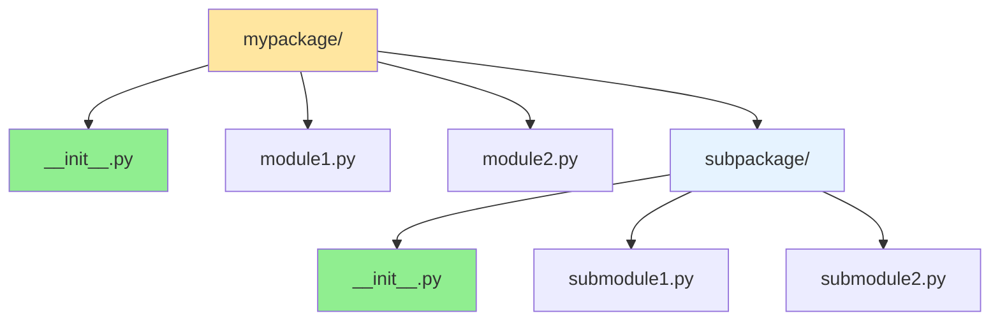

### The `__name__` and `__main__` Pattern

```python
# File: script.py
def main():
    """Main program logic"""
    print("Running main program")

# Module-level code
print(f"__name__ is: {__name__}")

# Only runs when executed directly (not when imported)
if __name__ == "__main__":
    main()

# When you run: python script.py
# Output:
# __name__ is: __main__
# Running main program

# When you import: import script
# Output:
# __name__ is: script
# (main() doesn't run)
```

### Virtual Environments

Virtual environments isolate project dependencies.

#### Creating Virtual Environments

```bash
# Using venv (built-in, Python 3.3+)
python -m venv myenv

# Activate virtual environment
# Windows:
myenv\Scripts\activate

# macOS/Linux:
source myenv/bin/activate

# Deactivate
deactivate

# Using virtualenv (third-party, more features)
pip install virtualenv
virtualenv myenv

# Using conda (Anaconda)
conda create -n myenv python=3.10
conda activate myenv
conda deactivate
```

#### Why Use Virtual Environments?

```python
# Problem without virtual environments:
# Project A needs Django 3.0
# Project B needs Django 4.0
# System-wide installation creates conflicts!

# Solution: Each project has its own environment
# ProjectA/myenv/ has Django 3.0
# ProjectB/myenv/ has Django 4.0
# No conflicts!
```

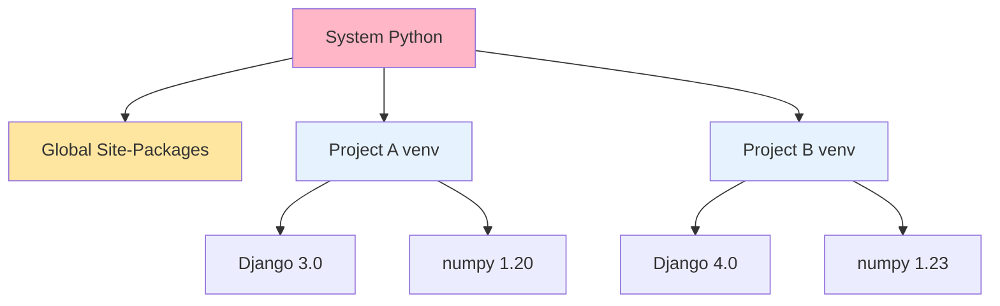

### Package Management with pip

```bash
# Install package
pip install requests

# Install specific version
pip install requests==2.28.0

# Install minimum version
pip install requests>=2.25.0

# Install from requirements file
pip install -r requirements.txt

# Uninstall package
pip uninstall requests

# List installed packages
pip list

# Show package details
pip show requests

# Search for packages (deprecated in newer pip versions)
pip search django

# Freeze current environment
pip freeze > requirements.txt

# Upgrade package
pip install --upgrade requests

# Install in editable mode (for development)
pip install -e .

# Install from git repository
pip install git+https://github.com/user/repo.git
```

#### requirements.txt

```
# requirements.txt
# Exact versions (reproducible)
requests==2.28.0
numpy==1.24.0
pandas==1.5.2

# Minimum version
Django>=4.0

# Version range
pytest>=7.0,<8.0

# With extras
requests[security]

# From GitHub
git+https://github.com/user/repo.git@v1.0

# Local package
-e ./my_local_package

# Include another requirements file
-r requirements-dev.txt
```

### Importing Best Practices

```python
# 1. Import order (PEP 8)
# Standard library imports
import os
import sys
from pathlib import Path

# Third-party imports
import numpy as np
import pandas as pd
import requests

# Local application imports
from myapp import config
from myapp.utils import helper_function

# 2. Avoid circular imports
# File: a.py
import b  # Imports b

def function_a():
    b.function_b()

# File: b.py
import a  # Circular! Imports a

def function_b():
    a.function_a()  # This will cause problems

# Solution: Import inside function, or restructure
# File: b.py
def function_b():
    import a  # Import here, not at module level
    a.function_a()

# 3. Lazy imports (for optional dependencies)
def plot_data(data):
    try:
        import matplotlib.pyplot as plt
    except ImportError:
        raise ImportError("matplotlib required for plotting")

    plt.plot(data)
    plt.show()

# 4. Use absolute imports over relative
# Good
from mypackage.module import function

# Less clear (relative)
from .module import function

# 5. Don't use import * except in __init__.py
# Bad
from module import *

# Good
from module import function1, function2

# Or
import module
```

### Creating Installable Packages

```python
# Directory structure
myproject/
    mypackage/
        __init__.py
        module1.py
        module2.py
    tests/
        __init__.py
        test_module1.py
    setup.py
    README.md
    LICENSE
    requirements.txt

# setup.py (traditional)
from setuptools import setup, find_packages

setup(
    name="mypackage",
    version="1.0.0",
    author="Your Name",
    author_email="you@example.com",
    description="A sample package",
    long_description=open("README.md").read(),
    long_description_content_type="text/markdown",
    url="https://github.com/yourusername/mypackage",
    packages=find_packages(),
    classifiers=[
        "Programming Language :: Python :: 3",
        "License :: OSI Approved :: MIT License",
        "Operating System :: OS Independent",
    ],
    python_requires=">=3.7",
    install_requires=[
        "requests>=2.25.0",
        "numpy>=1.20.0",
    ],
    extras_require={
        "dev": ["pytest", "black", "mypy"],
    },
)

# Install in development mode
# pip install -e .

# Build distribution
# python setup.py sdist bdist_wheel

# Upload to PyPI
# pip install twine
# twine upload dist/*

# pyproject.toml (modern, PEP 518)
[build-system]
requires = ["setuptools>=45", "wheel"]
build-backend = "setuptools.build_meta"

[project]
name = "mypackage"
version = "1.0.0"
description = "A sample package"
requires-python = ">=3.7"
dependencies = [
    "requests>=2.25.0",
    "numpy>=1.20.0",
]

[project.optional-dependencies]
dev = ["pytest", "black", "mypy"]
```

### Practical Example: Project Structure

```python
# Real-world project structure
myproject/
    ├── myapp/                 # Main package
    │   ├── __init__.py
    │   ├── config.py         # Configuration
    │   ├── models.py         # Data models
    │   ├── views.py          # Business logic
    │   ├── utils/            # Utilities subpackage
    │   │   ├── __init__.py
    │   │   ├── helpers.py
    │   │   └── validators.py
    │   └── api/              # API subpackage
    │       ├── __init__.py
    │       ├── routes.py
    │       └── handlers.py
    ├── tests/                # Test suite
    │   ├── __init__.py
    │   ├── test_models.py
    │   ├── test_views.py
    │   └── fixtures/
    ├── docs/                 # Documentation
    │   ├── conf.py
    │   └── index.md
    ├── scripts/              # Utility scripts
    │   └── setup_db.py
    ├── .env                  # Environment variables
    ├── .gitignore
    ├── requirements.txt      # Production dependencies
    ├── requirements-dev.txt  # Development dependencies
    ├── setup.py              # Package setup
    ├── README.md
    ├── LICENSE
    └── pyproject.toml

# File: myapp/__init__.py
"""
MyApp - A sample application
"""
from .config import Config
from .models import User, Product

__version__ = "1.0.0"
__all__ = ["Config", "User", "Product"]

# File: myapp/config.py
import os
from pathlib import Path

class Config:
    BASE_DIR = Path(__file__).parent.parent
    DEBUG = os.getenv("DEBUG", "False") == "True"
    DATABASE_URL = os.getenv("DATABASE_URL", "sqlite:///app.db")

# File: myapp/models.py
class User:
    def __init__(self, name, email):
        self.name = name
        self.email = email

class Product:
    def __init__(self, name, price):
        self.name = name
        self.price = price

# File: myapp/utils/helpers.py
def format_currency(amount):
    return f"${amount:.2f}"

# File: tests/test_models.py
import unittest
from myapp.models import User

class TestUser(unittest.TestCase):
    def test_user_creation(self):
        user = User("Alice", "alice@example.com")
        self.assertEqual(user.name, "Alice")

# File: main.py (entry point)
from myapp import Config, User
from myapp.utils.helpers import format_currency

def main():
    config = Config()
    user = User("Bob", "bob@example.com")
    print(f"User: {user.name}")

if __name__ == "__main__":
    main()
```

### Interview Insight: Why This Matters

Understanding modules and packages helps you:

- Organize code effectively
- Manage dependencies
- Create reusable libraries
- Avoid import conflicts

Common interview questions from this section:

- "What's the difference between a module and a package?"
- "Explain the purpose of **init**.py"
- "What does `if __name__ == '__main__':` do?"
- "How does Python's module search path work?"
- "What are relative vs absolute imports?"
- "Why use virtual environments?"
- "Explain the difference between pip install and pip install -e"
- "How do you create an installable Python package?"

---

## Standard Library Essentials

### Overview

Python's standard library is extensive, providing modules for common tasks without requiring external packages. Mastering key standard library modules is essential for efficient Python development.

### File and Directory Operations

#### os Module

```python
import os

# Current working directory
cwd = os.getcwd()
print(cwd)

# Change directory
os.chdir('/path/to/directory')

# List directory contents
files = os.listdir('.')
print(files)

# Create directory
os.mkdir('new_directory')
os.makedirs('path/to/nested/directory')  # Create intermediate directories

# Remove directory
os.rmdir('directory')  # Only if empty
os.removedirs('path/to/nested')  # Remove empty nested directories

# Remove file
os.remove('file.txt')

# Rename/move
os.rename('old_name.txt', 'new_name.txt')

# Check if exists
exists = os.path.exists('file.txt')
is_file = os.path.isfile('file.txt')
is_dir = os.path.isdir('directory')

# Path operations
path = os.path.join('directory', 'subdirectory', 'file.txt')
dirname = os.path.dirname(path)
basename = os.path.basename(path)
name, ext = os.path.splitext('file.txt')  # ('file', '.txt')

# Absolute path
abs_path = os.path.abspath('relative/path')

# Environment variables
home = os.environ.get('HOME')
os.environ['MY_VAR'] = 'value'

# Execute system command
exit_code = os.system('ls -l')

# Get file stats
stats = os.stat('file.txt')
print(stats.st_size)  # Size in bytes
print(stats.st_mtime)  # Last modified time
```

#### pathlib Module (Modern, OOP approach)

```python
from pathlib import Path

# Create Path object
p = Path('directory/file.txt')
p = Path.home() / 'documents' / 'file.txt'  # Home directory

# Current working directory
cwd = Path.cwd()

# Check existence
if p.exists():
    print("File exists")

if p.is_file():
    print("It's a file")

if p.is_dir():
    print("It's a directory")

# Read/write files
content = p.read_text()  # Read entire file
p.write_text("Hello, World!")  # Write to file

# Binary read/write
data = p.read_bytes()
p.write_bytes(b'\x00\x01\x02')

# Path properties
print(p.name)        # 'file.txt'
print(p.stem)        # 'file'
print(p.suffix)      # '.txt'
print(p.parent)      # Path('directory')
print(p.parts)       # ('directory', 'file.txt')

# Create directory
p.mkdir(parents=True, exist_ok=True)

# List directory contents
for item in Path('.').iterdir():
    print(item)

# Glob patterns
for txt_file in Path('.').glob('*.txt'):
    print(txt_file)

# Recursive glob
for py_file in Path('.').rglob('*.py'):
    print(py_file)

# Rename/move
p.rename('new_name.txt')

# Delete
p.unlink()  # Remove file
p.rmdir()   # Remove empty directory

# File stats
stats = p.stat()
print(f"Size: {stats.st_size} bytes")
```

#### shutil Module (High-level file operations)

```python
import shutil

# Copy file
shutil.copy('source.txt', 'destination.txt')
shutil.copy2('source.txt', 'dest.txt')  # Preserve metadata

# Copy directory tree
shutil.copytree('source_dir', 'dest_dir')

# Remove directory tree
shutil.rmtree('directory')

# Move file or directory
shutil.move('source', 'destination')

# Disk usage
usage = shutil.disk_usage('/')
print(f"Total: {usage.total / (1024**3):.2f} GB")
print(f"Used: {usage.used / (1024**3):.2f} GB")
print(f"Free: {usage.free / (1024**3):.2f} GB")

# Archive operations
shutil.make_archive('backup', 'zip', 'directory_to_backup')
shutil.unpack_archive('backup.zip', 'extract_to')

# Find executable
python_path = shutil.which('python')
```

### Data Serialization

#### json Module

```python
import json

# Python object to JSON string
data = {
    'name': 'Alice',
    'age': 30,
    'hobbies': ['reading', 'coding'],
    'active': True
}

json_string = json.dumps(data)
print(json_string)

# With formatting
json_string = json.dumps(data, indent=4, sort_keys=True)

# JSON string to Python object
parsed = json.loads(json_string)

# Write to file
with open('data.json', 'w') as f:
    json.dump(data, f, indent=4)

# Read from file
with open('data.json', 'r') as f:
    data = json.load(f)

# Custom serialization
from datetime import datetime

class DateTimeEncoder(json.JSONEncoder):
    def default(self, obj):
        if isinstance(obj, datetime):
            return obj.isoformat()
        return super().default(obj)

data = {'timestamp': datetime.now()}
json_string = json.dumps(data, cls=DateTimeEncoder)
```

#### pickle Module (Python-specific serialization)

```python
import pickle

# Serialize complex Python objects
data = {
    'list': [1, 2, 3],
    'dict': {'key': 'value'},
    'function': lambda x: x * 2
}

# Save to file
with open('data.pkl', 'wb') as f:
    pickle.dump(data, f)

# Load from file
with open('data.pkl', 'rb') as f:
    loaded_data = pickle.load(f)

# Serialize to bytes
bytes_data = pickle.dumps(data)
restored = pickle.loads(bytes_data)

# Warning: Only unpickle data from trusted sources!
# pickle can execute arbitrary code
```

#### csv Module

```python
import csv

# Write CSV
data = [
    ['Name', 'Age', 'City'],
    ['Alice', 30, 'NYC'],
    ['Bob', 25, 'LA'],
    ['Charlie', 35, 'Chicago']
]

with open('data.csv', 'w', newline='') as f:
    writer = csv.writer(f)
    writer.writerows(data)

# Read CSV
with open('data.csv', 'r') as f:
    reader = csv.reader(f)
    for row in reader:
        print(row)

# DictReader/DictWriter
with open('data.csv', 'w', newline='') as f:
    fieldnames = ['Name', 'Age', 'City']
    writer = csv.DictWriter(f, fieldnames=fieldnames)

    writer.writeheader()
    writer.writerow({'Name': 'Alice', 'Age': 30, 'City': 'NYC'})
    writer.writerow({'Name': 'Bob', 'Age': 25, 'City': 'LA'})

with open('data.csv', 'r') as f:
    reader = csv.DictReader(f)
    for row in reader:
        print(row['Name'], row['Age'])
```

### Date and Time

#### datetime Module

```python
from datetime import datetime, date, time, timedelta

# Current date and time
now = datetime.now()
print(now)  # 2026-05-15 14:30:00.123456

today = date.today()
print(today)  # 2026-05-15

# Create specific datetime
dt = datetime(2026, 5, 15, 14, 30, 0)

# Parse string to datetime
dt = datetime.strptime('2026-05-15 14:30', '%Y-%m-%d %H:%M')

# Format datetime to string
formatted = dt.strftime('%B %d, %Y at %I:%M %p')
print(formatted)  # May 15, 2026 at 02:30 PM

# Date/time components
print(dt.year, dt.month, dt.day)
print(dt.hour, dt.minute, dt.second)

# Timedelta (duration)
delta = timedelta(days=7, hours=3, minutes=30)
future = now + delta
past = now - delta

# Difference between dates
diff = date(2026, 12, 31) - date.today()
print(f"Days until end of year: {diff.days}")

# Compare dates
if date.today() > date(2025, 1, 1):
    print("We're past 2025!")

# ISO format
iso = dt.isoformat()  # '2026-05-15T14:30:00'
dt = datetime.fromisoformat(iso)

# Timestamp (Unix epoch)
timestamp = dt.timestamp()
dt = datetime.fromtimestamp(timestamp)
```

#### time Module

```python
import time

# Current time (seconds since epoch)
now = time.time()
print(now)

# Sleep (pause execution)
time.sleep(1)  # Sleep for 1 second
time.sleep(0.1)  # Sleep for 100ms

# Measure execution time
start = time.time()
# ... code to measure ...
end = time.time()
elapsed = end - start
print(f"Execution time: {elapsed:.4f} seconds")

# Performance counter (higher resolution)
start = time.perf_counter()
# ... code ...
end = time.perf_counter()
elapsed = end - start

# Format time
local_time = time.localtime()
formatted = time.strftime('%Y-%m-%d %H:%M:%S', local_time)
```

### Collections

#### collections Module

```python
from collections import (
    Counter, defaultdict, OrderedDict,
    deque, namedtuple, ChainMap
)

# Counter - count hashable objects
text = "hello world"
counter = Counter(text)
print(counter)  # Counter({'l': 3, 'o': 2, 'h': 1, ...})
print(counter.most_common(2))  # [('l', 3), ('o', 2)]

# defaultdict - dict with default values
dd = defaultdict(int)
for char in "hello":
    dd[char] += 1
print(dd)  # defaultdict(<class 'int'>, {'h': 1, 'e': 1, 'l': 2, 'o': 1})

dd = defaultdict(list)
dd['key'].append(1)  # No KeyError!

# deque - double-ended queue (efficient appends/pops from both ends)
dq = deque([1, 2, 3])
dq.append(4)        # Add to right
dq.appendleft(0)    # Add to left
dq.pop()            # Remove from right
dq.popleft()        # Remove from left
dq.rotate(1)        # Rotate right
dq.rotate(-1)       # Rotate left

# namedtuple - tuple with named fields
Point = namedtuple('Point', ['x', 'y'])
p = Point(10, 20)
print(p.x, p.y)  # 10 20
print(p[0], p[1])  # 10 20 (still works like tuple)

# ChainMap - combine multiple dicts
dict1 = {'a': 1, 'b': 2}
dict2 = {'b': 3, 'c': 4}
chain = ChainMap(dict1, dict2)
print(chain['a'])  # 1
print(chain['b'])  # 2 (from dict1, first dict takes precedence)
print(chain['c'])  # 4
```

### Itertools

```python
import itertools

# count - infinite counter
for i in itertools.count(10, 2):  # Start at 10, step 2
    if i > 20:
        break
    print(i)  # 10, 12, 14, 16, 18, 20

# cycle - infinite cycle through iterable
counter = 0
for item in itertools.cycle(['A', 'B', 'C']):
    if counter >= 7:
        break
    print(item)  # A, B, C, A, B, C, A
    counter += 1

# repeat - repeat element
for x in itertools.repeat('Hello', 3):
    print(x)  # Hello, Hello, Hello

# chain - chain iterables
combined = itertools.chain([1, 2], [3, 4], [5, 6])
print(list(combined))  # [1, 2, 3, 4, 5, 6]

# combinations - all combinations of length r
print(list(itertools.combinations([1, 2, 3], 2)))
# [(1, 2), (1, 3), (2, 3)]

# permutations - all permutations of length r
print(list(itertools.permutations([1, 2, 3], 2)))
# [(1, 2), (1, 3), (2, 1), (2, 3), (3, 1), (3, 2)]

# product - Cartesian product
print(list(itertools.product([1, 2], ['A', 'B'])))
# [(1, 'A'), (1, 'B'), (2, 'A'), (2, 'B')]

# groupby - group consecutive elements
data = [('A', 1), ('A', 2), ('B', 3), ('B', 4), ('A', 5)]
for key, group in itertools.groupby(data, lambda x: x[0]):
    print(key, list(group))
# A [('A', 1), ('A', 2)]
# B [('B', 3), ('B', 4)]
# A [('A', 5)]

# islice - slice iterator
print(list(itertools.islice(range(10), 2, 7)))  # [2, 3, 4, 5, 6]

# takewhile/dropwhile
print(list(itertools.takewhile(lambda x: x < 5, [1, 2, 3, 6, 4, 1])))
# [1, 2, 3]
```

### Regular Expressions

```python
import re

text = "Contact us at support@example.com or sales@example.com"

# Search for pattern
match = re.search(r'\w+@\w+\.\w+', text)
if match:
    print(match.group())  # support@example.com

# Find all matches
emails = re.findall(r'\w+@\w+\.\w+', text)
print(emails)  # ['support@example.com', 'sales@example.com']

# Match from start
match = re.match(r'Contact', text)
if match:
    print("Starts with 'Contact'")

# Substitute
new_text = re.sub(r'\w+@\w+\.\w+', '[EMAIL]', text)
print(new_text)  # Contact us at [EMAIL] or [EMAIL]

# Split
parts = re.split(r'\s+', "Split   by    whitespace")
print(parts)  # ['Split', 'by', 'whitespace']

# Compile pattern (for reuse)
pattern = re.compile(r'\w+@\w+\.\w+')
emails = pattern.findall(text)

# Groups
text = "John Doe, 30 years old"
match = re.search(r'(\w+) (\w+), (\d+)', text)
if match:
    print(match.group(1))  # John
    print(match.group(2))  # Doe
    print(match.group(3))  # 30
    print(match.groups())  # ('John', 'Doe', '30')

# Named groups
match = re.search(r'(?P<first>\w+) (?P<last>\w+)', text)
if match:
    print(match.group('first'))  # John
    print(match.groupdict())     # {'first': 'John', 'last': 'Doe'}

# Flags
match = re.search(r'HELLO', 'hello', re.IGNORECASE)
match = re.search(r'^line1.*line2', 'line1\nline2', re.MULTILINE | re.DOTALL)
```

### Random Numbers

```python
import random

# Random integer
n = random.randint(1, 10)  # 1 to 10 inclusive

# Random float [0.0, 1.0)
f = random.random()

# Random float in range
f = random.uniform(1.0, 10.0)

# Random choice
color = random.choice(['red', 'green', 'blue'])

# Random sample (without replacement)
sample = random.sample([1, 2, 3, 4, 5], 3)  # e.g., [2, 5, 1]

# Shuffle list in place
items = [1, 2, 3, 4, 5]
random.shuffle(items)

# Random choices (with replacement)
choices = random.choices([1, 2, 3], weights=[1, 2, 3], k=5)

# Set seed for reproducibility
random.seed(42)
print(random.random())  # Always same value with seed 42
```

### Practical Example: Log File Analyzer

```python
import re
from collections import Counter, defaultdict
from datetime import datetime
from pathlib import Path

class LogAnalyzer:
    """Analyze log files using standard library"""

    def __init__(self, log_file):
        self.log_file = Path(log_file)
        self.entries = []
        self.error_pattern = re.compile(
            r'(\d{4}-\d{2}-\d{2} \d{2}:\d{2}:\d{2}) - (\w+) - (.+)'
        )

    def parse(self):
        """Parse log file"""
        with open(self.log_file, 'r') as f:
            for line in f:
                match = self.error_pattern.match(line.strip())
                if match:
                    timestamp, level, message = match.groups()
                    dt = datetime.strptime(timestamp, '%Y-%m-%d %H:%M:%S')
                    self.entries.append({
                        'timestamp': dt,
                        'level': level,
                        'message': message
                    })

    def count_by_level(self):
        """Count entries by log level"""
        levels = [entry['level'] for entry in self.entries]
        return Counter(levels)

    def errors_by_hour(self):
        """Group errors by hour"""
        by_hour = defaultdict(int)
        for entry in self.entries:
            if entry['level'] == 'ERROR':
                hour = entry['timestamp'].hour
                by_hour[hour] += 1
        return dict(sorted(by_hour.items()))

    def most_common_errors(self, n=5):
        """Find most common error messages"""
        errors = [
            entry['message'] for entry in self.entries
            if entry['level'] == 'ERROR'
        ]
        return Counter(errors).most_common(n)

    def summary(self):
        """Generate summary report"""
        print("=" * 50)
        print("LOG ANALYSIS SUMMARY")
        print("=" * 50)

        print(f"\nTotal entries: {len(self.entries)}")

        print("\nEntries by level:")
        for level, count in self.count_by_level().most_common():
            print(f"  {level}: {count}")

        print("\nErrors by hour:")
        for hour, count in self.errors_by_hour().items():
            print(f"  {hour:02d}:00 - {count} errors")

        print("\nMost common errors:")
        for message, count in self.most_common_errors(3):
            print(f"  [{count}x] {message[:50]}...")

# Usage
# analyzer = LogAnalyzer('app.log')
# analyzer.parse()
# analyzer.summary()
```

### Interview Insight: Why This Matters

Understanding the standard library helps you:

- Avoid reinventing the wheel
- Write efficient, idiomatic code
- Leverage battle-tested modules
- Minimize external dependencies

Common interview questions from this section:

- "What's the difference between os.path and pathlib?"
- "How do you serialize Python objects?"
- "Explain the difference between json and pickle"
- "What are collections.defaultdict and collections.Counter?"
- "How do you work with dates and times in Python?"
- "What's the difference between time.time() and time.perf_counter()?"
- "Explain itertools.chain and itertools.groupby"
- "How do you use regular expressions in Python?"

---

**End of Sections 6, 7, and 8**

_Ready for the next sections. Type "Continue with the next section" to proceed with Section 9: Memory Management and References._
